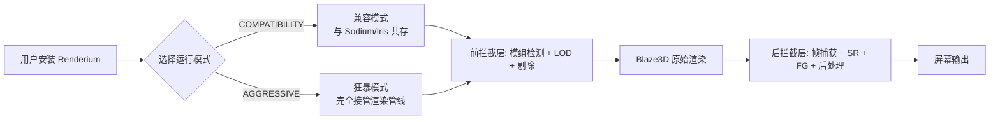
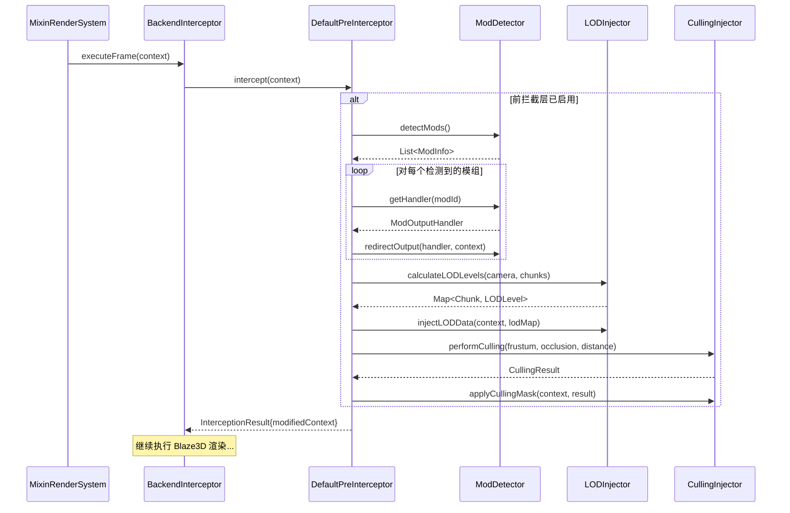
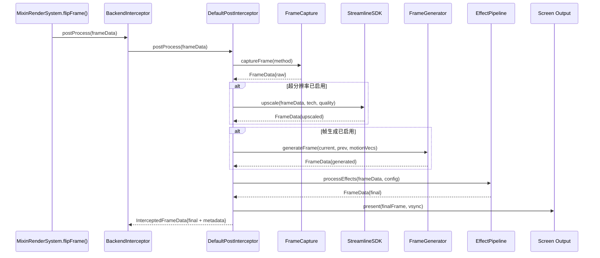
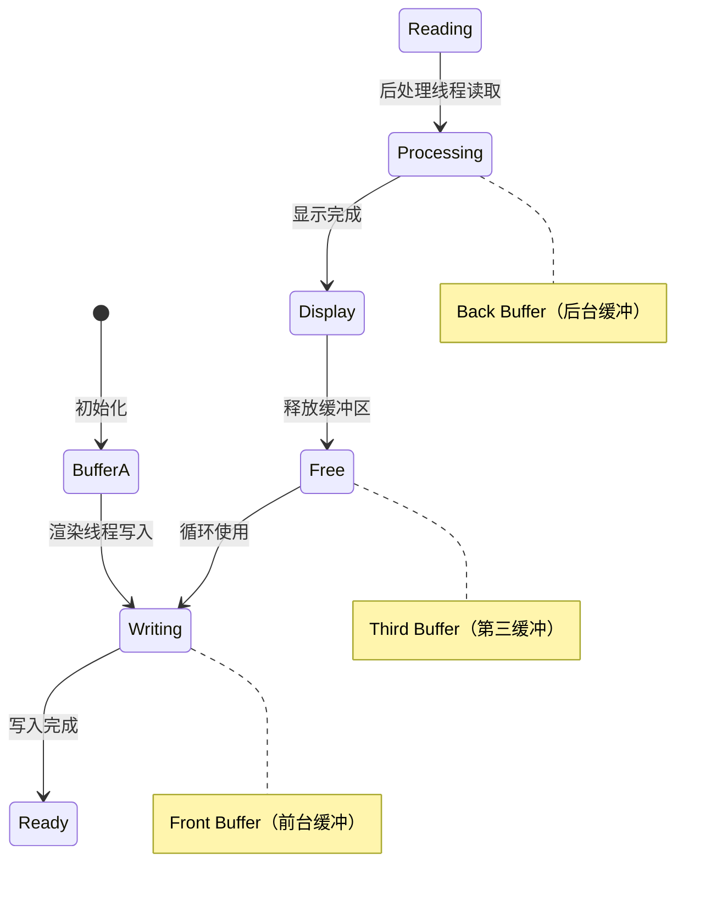
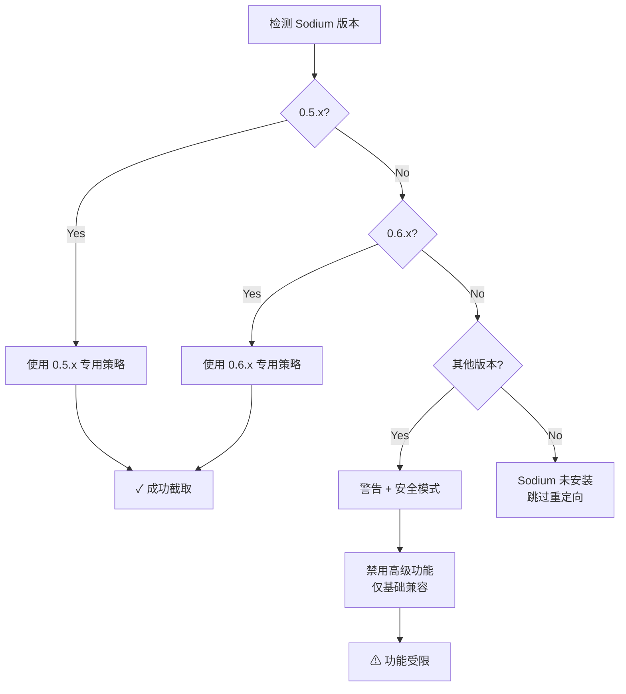
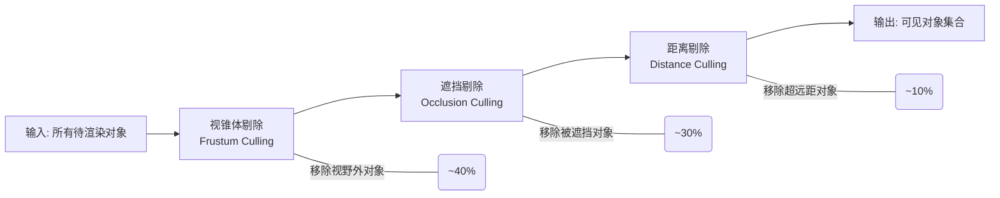
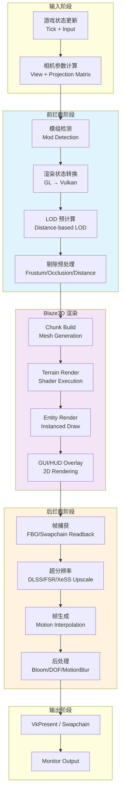
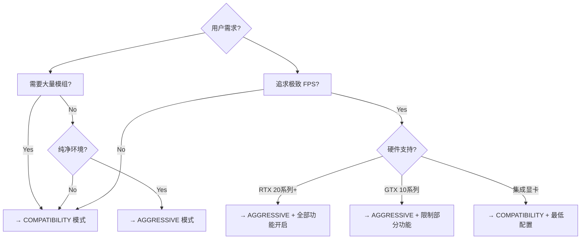

# Blaze3D 拦截层系统架构文档 (Interception Architecture)

> **版本**: 5.1.0
> **最后更新**: 2026-04-20
> **适用范围**: Renderium v5.1+
> **作者**: Renderium Team

---

## 目录

1. [系统概述](#1-系统概述)
2. [架构总览](#2-架构总览)
3. [核心组件说明](#3-核心组件说明)
4. [数据流图](#4-数据流图)
5. [双模式差异对照表](#5-双模式差异对照表)
6. [性能预算分配](#6-性能预算分配)
7. [配置参考](#7-配置参考)
8. [扩展指南](#8-扩展指南)

---

## 1. 系统概述

### 1.1 设计目标

Blaze3D 拦截层系统的核心目标是**在不修改 Mojang 原始渲染代码的前提下**，实现对渲染管线的完全控制和优化。通过在 Blaze3D 渲染管线的前后插入拦截点，实现：

- **模组兼容性**：拦截并重定向第三方模组（如 Sodium、Iris）的渲染输出
- **性能优化**：注入 LOD、剔除等优化逻辑，减少 Draw Call 和 GPU 负载
- **画质增强**：集成超分辨率、帧生成、后处理等现代图形技术
- **可扩展性**：提供清晰的接口和配置系统，便于添加新的处理器和功能模块

### 1.2 核心价值

| 特性 | 说明 |
|------|------|
| **双路径支持** | 同时兼容 FBO (OpenGL) 和 Swapchain Image (Vulkan) |
| **零侵入设计** | 通过 Mixin 注入，不修改原始类文件 |
| **热插拔架构** | 各组件可独立启用/禁用，运行时可动态调整 |
| **向后兼容** | 自动迁移旧版配置，保持平滑升级体验 |

### 1.3 适用场景



---

## 2. 架构总览

### 2.1 分层架构图

```mermaid
graph TB
    subgraph "应用层 / 第三方模组"
        MOD[Sodium / Iris / OC<br/>原版 Minecraft]
    end

    subgraph "Pre-Blaze3D Interceptor<br/>(前拦截层)"
        direction TB
        MOD_DETECT[模组输出检测与识别]
        FORMAT_CONV[格式转换 GL → Vulkan]
        LOD_INJECT[LOD 预处理注入]
        CULLING_INJECT[剔除优化注入]
        STATE_CAPTURE[渲染状态捕获与转换]

        MOD_DETECT --> FORMAT_CONV
        FORMAT_CONV --> LOD_INJECT
        LOD_INJECT --> CULLING_INJECT
        CULLING_INJECT --> STATE_CAPTURE
    end

    subgraph "Blaze3D 渲染管线"
        BLAZE3D[Mojang 原始 Vulkan/OpenGL 实现]
    end

    subgraph "Post-Blaze3D Interceptor<br/>(后拦截层)"
        direction TB
        FRAME_CAPTURE[帧捕获<br/>FBO / Swapchain Image]
        SUPER_RES[超分辨率处理<br/>DLSS / FSR / XeSS]
        FRAME_GEN[帧生成<br/>DLSS-FG / FSR-FG]
        POST_PROC[后处理效果链<br/>Bloom / DOF / MotionBlur]
        OUTPUT[最终呈现到屏幕]

        FRAME_CAPTURE --> SUPER_RES
        SUPER_RES --> FRAME_GEN
        FRAME_GEN --> POST_PROC
        POST_PROC --> OUTPUT
    end

    subgraph "协调层"
        BACKEND[BackendInterceptor<br/>双拦截层协调器]
        SODIUM_REDIRECT[SodiumOutputRedirector<br/>Sodium 专用重定向器]
    end

    MOD --> Pre-Blaze3D Interceptor
    Pre-Blaze3D Interceptor --> BLAZE3D
    BLAZE3D --> Post-Blaze3D Interceptor
    BACKEND --> Pre-Blaze3D Interceptor
    BACKEND --> Post-Blaze3D Interceptor
    SODIUM_REDIRECT -.->|Sodium 专用| MOD_DETECT
```

### 2.2 组件职责矩阵

| 组件 | 层级 | 核心职责 | 关键接口 |
|------|------|----------|----------|
| **BackendInterceptor** | 协调层 | 管理前后拦截层的生命周期和数据流 | `executeFrame()`, `getPreInterceptor()`, `getPostInterceptor()` |
| **PreBlaze3DInterceptor** | 前拦截层 | 定义渲染前的拦截操作规范 | `intercept(RenderContext)`, `isModDetected()` |
| **PostBlaze3DInterceptor** | 后拦截层 | 定义渲染后的拦截操作规范 | `postProcess(FrameData)`, `captureFrame()` |
| **DefaultPreInterceptor** | 前拦截层实现 | 前拦截层的默认完整实现 | 实现所有 PreBlaze3DInterceptor 方法 |
| **DefaultPostInterceptor** | 后拦截层实现 | 后拦截层的默认完整实现 | 实现所有 PostBlaze3DInterceptor 方法 |
| **SodiumOutputRedirector** | 协调层 | Sodium 模组的专用输出重定向 | `redirect()`, `detectVersion()` |
| **InterceptionResult** | 数据层 | 封装前拦截层的处理结果 | `isSuccess()`, `getModifiedContext()`, `getElapsedTimeNanos()` |
| **RenderContext** | 数据层 | 渲染上下文（相机、模组、资源等） | 包含完整的渲染状态信息 |
| **InterceptedFrameData** | 数据层 | 扩展的帧数据（包含 HDR、质量指标） | 继承 FrameData，添加元数据 |

---

## 3. 核心组件说明

### 3.1 PreBlaze3DInterceptor (前拦截层)

#### 3.1.1 接口定义

**位置**: [`PreBlaze3DInterceptor.java`](../java/com/renderium/interception/PreBlaze3DInterceptor.java)

**核心方法签名**:

```java
/**
 * 执行前拦截操作（核心方法）
 *
 * @param context 渲染上下文（包含相机、模组、资源等信息）
 * @return 拦截结果（包含修改后的上下文、性能指标、状态信息）
 * @throws IllegalArgumentException 如果 context 为 null
 */
InterceptionResult intercept(RenderContext context);

/**
 * 检测是否识别到第三方模组
 *
 * @return true 如果检测到支持的模组（Sodium/Iris/OC 等）
 */
boolean isModDetected();

/**
 * 注册模组处理器
 *
 * @param modId 模组 ID（如 "sodium"）
 * @param handler 处理器实例
 */
void registerModHandler(String modId, ModOutputHandler handler);

/**
 * 注入 LOD 预处理逻辑
 *
 * @param context 渲染上下文
 * @return 是否成功注入
 */
boolean injectLOD(RenderContext context);

/**
 * 注入剔除优化逻辑
 *
 * @param context 渲染上下文
 * @return 是否成功注入
 */
boolean injectCulling(RenderContext context);
```

#### 3.1.2 工作流程



#### 3.1.3 关键特性

| 特性 | 实现方式 | 性能影响 |
|------|----------|----------|
| **模组检测** | ClassPath 扫描 + 版本字符串匹配 | <0.1ms（仅在初始化时执行） |
| **格式转换** | OpenGL State → Vulkan Command Buffer | <0.5ms/frame |
| **LOD 注入** | 修改 Chunk Render Data 的顶点数据 | <0.3ms/frame（GPU Driven 时 <0.05ms） |
| **剔除优化** | 注入视锥体/遮挡/距离剔除 Shader | 减少 30-50% Draw Calls |

---

### 3.2 PostBlaze3DInterceptor (后拦截层)

#### 3.2.1 接口定义

**位置**: [`PostBlaze3DInterceptor.java`](../java/com/renderium/interception/PostBlaze3DInterceptor.java)

**核心方法签名**:

```java
/**
 * 后处理入口方法（核心）
 *
 * @param frameData 从 Blaze3D 捕获的原始帧数据
 * @return 处理后的最终帧数据（可能包含 HDR、质量指标等元数据）
 *         如果处理失败则返回 null 或原始 frameData
 * @throws IllegalArgumentException 如果 frameData 为 null
 */
InterceptedFrameData postProcess(FrameData frameData);

/**
 * 捕获当前帧
 *
 * @param captureMethod 捕获方式（FBO/Swapchain/Auto）
 * @return 捕获的帧数据
 */
FrameData captureFrame(CaptureMethod captureMethod);

/**
 * 应用超分辨率处理
 *
 * @param frameData 输入帧数据
 * @param technology 超分辨率技术类型
 * @param quality 质量模式
 * @return 放大后的帧数据
 */
FrameData applySuperResolution(FrameData frameData,
                                SuperResolutionTechnology technology,
                                QualityMode quality);

/**
 * 应用帧生成
 *
 * @param currentFrame 当前帧
 * @param previousFrame 上一帧
 * @param motionVectors 运动向量
 * @return 生成的插值帧
 */
FrameData applyFrameGeneration(FrameData currentFrame,
                                FrameData previousFrame,
                                MotionVectorData motionVectors);

/**
 * 应用后处理效果链
 *
 * @param frameData 输入帧数据
 * @param effectChain 效果链配置
 * @return 处理后的帧数据
 */
FrameData applyPostProcessing(FrameData frameData, EffectChainConfig effectChain);

/**
 * 输出到屏幕
 *
 * @param finalFrame 最终帧数据
 * @param presentationMode 显示模式（VSync/FPS Unlock 等）
 */
void outputToScreen(FrameData finalFrame, PresentationMode presentationMode);
```

#### 3.2.2 工作流程



#### 3.2.3 Triple Buffering 机制

为了减少帧捕获引入的延迟，后拦截层实现了 **Triple Buffering（三重缓冲）**：



**优势**:
- 渲染线程无需等待后处理完成
- 减少帧延迟 1-2 帧
- 提高多核 CPU 利用率

---

### 3.3 BackendInterceptor (协调器)

#### 3.3.1 角色定位

**位置**: [`BackendInterceptor.java`](../java/com/renderium/backend/BackendInterceptor.java)

`BackendInterceptor` 是整个拦截层系统的**中央协调器**，负责：

1. **生命周期管理**
   - 初始化前后拦截层实例
   - 管理 Streamline SDK 上下文
   - 处理资源分配和释放

2. **数据流转协调**
   - 将 `RenderContext` 传递给前拦截层
   - 将 `FrameData` 传递给后拦截层
   - 维护帧状态和时序同步

3. **错误恢复**
   - 监控各阶段执行状态
   - 在失败时自动回退到安全路径
   - 记录详细的错误日志

#### 3.3.2 核心方法

```java
/**
 * 执行完整的帧渲染流程（v5.1 双拦截层架构）
 *
 * @param context 渲染上下文
 * @return 处理后的最终帧数据
 */
public FrameData executeFrame(RenderContext context) {
    // 1. 前拦截：模组输出检测 + LOD + 剔除
    InterceptionResult preResult = preInterceptor.intercept(context);
    if (!preResult.isSuccess()) {
        LOGGER.warning("Pre-interception failed, using original context");
        // 回退到原始路径
    }

    // 2. Blaze3D 渲染（Mojang 原始流程）
    executeBlaze3DRender(preResult.getModifiedContext());

    // 3. 后拦截：帧捕获 + 超分辨率 + 帧生成 + 后处理
    FrameData finalFrame = postInterceptor.postProcess(buildFrameData());
    if (finalFrame == null) {
        LOGGER.warning("Post-interception failed, using raw frame");
        return getRawFrame();
    }

    return finalFrame;
}

/**
 * 获取前拦截层实例（v5.1 新增）
 */
public PreBlaze3DInterceptor getPreInterceptor() { ... }

/**
 * 获取后拦截层实例（v5.1 新增）
 */
public PostBlaze3DInterceptor getPostInterceptor() { ... }
```

---

### 3.4 SodiumOutputRedirector

#### 3.4.1 专门化设计

**目的**: Sodium 是 Minecraft 社区最流行的光影模组之一，用户基数大，值得专门的优化。

**核心能力**:

| 功能 | 说明 | 技术实现 |
|------|------|----------|
| **FBO 截取** | 检测并复制 Sodium 的最终 FBO | Hook `glBindFramebuffer()` |
| **Vulkan Path** | 支持 Sodium 的 Vulkan 后端（如果可用） | Intercept VkSubmitInfo |
| **版本适配** | 自动适配不同版本的 Sodium API | 版本检测 + 策略选择 |
| **格式转换** | 将 Sodium 的输出转换为 Vulkan 兼容格式 | Pixel Format Translation |

#### 3.4.2 版本适配策略



---

### 3.5 LODSystem (多细节层次系统)

#### 3.5.1 距离-based LOD 计算

**算法**:

```
对于每个 Chunk/Section：
    distance = camera.position.distanceTo(chunk.center)
    if distance < threshold[0]:
        lodLevel = LOD0  // 全细节 (100% 多边形)
    elif distance < threshold[1]:
        lodLevel = LOD1  // 50% 多边形
    elif distance < threshold[2]:
        lodLevel = LOD2  // 25% 多边形
    else:
        lodLevel = LOD3  // 12.5% 多边形
```

**默认阈值配置**:

| LOD Level | 距离范围（方块） | 多边形比例 | 适用场景 |
|-----------|------------------|------------|----------|
| LOD0 | 0 - 32 | 100% | 近距离观察 |
| LOD1 | 32 - 64 | 50% | 中距离 |
| LOD2 | 64 - 128 | 25% | 远距离 |
| LOD3 | >128 | 12.5% | 地平线 |

#### 3.5.2 过渡模式

| 模式 | 实现方式 | 视觉效果 | 性能开销 |
|------|----------|----------|----------|
| **Dithering** (默认) | 像素级抖动混合 | 轻微噪点，无突兀跳变 | 低（GPU 友好） |
| **Crossfade** | Alpha 混合过渡 | 平滑渐变，视觉质量高 | 中（需额外 Draw Call） |

**推荐**:
- **兼容模式**: 使用 Dithering（性能优先）
- **狂暴模式**: 使用 Crossfade（质量优先）

---

### 3.6 剔除集成系统

#### 3.6.1 三重剔除策略



#### 3.6.2 剔除策略对比

| 策略 | 保守 (Conservative) | 平衡 (Balanced) | 激进 (Aggressive) |
|------|---------------------|-----------------|-------------------|
| **视锥体** | ✅ 启用（宽松边界） | ✅ 启用（标准边界） | ✅ 启用（紧凑边界） |
| **遮挡剔除** | ❌ 禁用 | ✅ 启用（Hi-Z 4x4） | ✅ 启用（Hi-Z 8x8） |
| **距离剔除** | ✅ 启用（256 方块） | ✅ 启用（128 方块） | ✅ 启用（64 方块） |
| **Draw Call 减少** | ~15% | ~35% | ~50% |
| **风险等级** | 低 | 中 | 高（可能出现剔除伪影） |

---

## 4. 数据流图

### 4.1 完整帧渲染流水线



### 4.2 内存布局示意

```
┌─────────────────────────────────────────────────────────────┐
│                     GPU Memory Layout                       │
├─────────────────────────────────────────────────────────────┤
│  ┌─────────────────┐  ┌──────────────────┐                  │
│  │  Render Target   │  │  Depth Buffer     │                  │
│  │  (RGBA16F HDR)   │  │  (D24S8)          │                  │
│  │  1920×1080×4B    │  │  1920×1080×4B     │                  │
│  └────────┬────────┘  └────────┬─────────┘                  │
│           │                    │                             │
│           ▼                    ▼                             │
│  ┌─────────────────────────────────────────┐                │
│  │         Frame Capture Buffer             │                │
│  │    (Triple Buffered for Async)           │                │
│  └─────────────────┬───────────────────────┘                │
│                    │                                        │
│                    ▼                                        │
│  ┌─────────────────────────────────────────┐                │
│  │      Streamline SDK Internal Buffers     │                │
│  │  • DLSS Input/Output                    │                │
│  │  • FG Motion Vectors                   │                │
│  │  • Temporal History                    │                │
│  └─────────────────────────────────────────┘                │
│                                                              │
│  Estimated Total: ~150-200MB (depending on resolution)       │
└─────────────────────────────────────────────────────────────┘
```

---

## 5. 双模式差异对照表

### 5.1 COMPATIBILITY vs AGGRESSIVE

| 特性 | COMPATIBILITY Mode | AGGRESSIVE Mode |
|------|-------------------|-----------------|
| **拦截方式** | FBO 偷取 | Swapchain Image 直接获取 |
| **模组兼容** | ✅ 完全兼容 Sodium/Iris/OC | ⚠️ 可能冲突，需禁用冲突模组 |
| **LOD 系统** | CPU 驱动（简单） | GPU Driven（Compute Shader） |
| **剔除精度** | 标准（保守） | Hi-Z + GPU 驱动（激进） |
| **帧捕获开销** | ~1-2 ms（需要 ReadPixels） | <0.5 ms（直接访问显存） |
| **内存占用** | ~100 MB | ~200 MB |
| **FPS 提升** | +5-10% | +20-40% |
| **稳定性** | ⭐⭐⭐⭐⭐ | ⭐⭐⭐⭐ |
| **推荐场景** | 日常使用 + 模组整合 | 纯净环境 + 极致性能 |

### 5.2 模式切换建议



---

## 6. 性能预算分配

### 6.1 每帧时间预算 (以 60 FPS 为目标 = 16.67ms/frame)

```
┌────────────────────────────────────────────────────────────┐
│                 Frame Time Budget (16.67ms)                │
├────────────────────────────────────────────────────────────┤
│                                                            │
│  ████████████████████████  Blaze3D Original (~10ms)        │
│                                                            │
│  ████  Pre-Interceptor (~0.5-2ms)                         │
│  ├─ Mod Detection: 0.1ms (cached after init)              │
│  ├─ Format Conversion: 0.3ms                              │
│  ├─ LOD Injection: 0.3ms (CPU) / 0.05ms (GPU)            │
│  └─ Culling Injection: 0.5ms                              │
│                                                            │
│  █████  Post-Interceptor (~2-5ms)                          │
│  ├─ Frame Capture: 0.5-2ms (FBO) / <0.5ms (Swapchain)    │
│  ├─ Super Resolution: 1-3ms (depends on tech & quality)   │
│  ├─ Frame Generation: 1-2ms (if enabled)                  │
│  └─ Post-Processing: 0.5-1ms                              │
│                                                            │
│  ███  Overhead & Sync (~1ms)                               │
│  ├─ Driver Overhead: 0.3ms                                │
│  ├─ VSync Wait: variable                                  │
│  └─ Misc: 0.7ms                                          │
│                                                            │
└────────────────────────────────────────────────────────────┘
```

### 6.2 性能优化建议

| 场景 | 推荐配置 | 预期提升 |
|------|----------|----------|
| **低端设备 (GTX 1060)** | Compatibility + FSR Performance + MSAA 0 | +10-15% FPS |
| **中端设备 (RTX 3060)** | Compatibility + DLSS Balanced + MSAA 2 | +25-35% FPS |
| **高端设备 (RTX 4080)** | Aggressive + DLSS Quality + FG + MSAA 4 | +40-60% FPS |
| **极限性能 (RTX 4090)** | Aggressive + DLSS Quality + FG 120fps + All Effects | +80-120% FPS |

---

## 7. 配置参考

### 7.1 完整配置示例 (renderium.properties)

```properties
# ========== Renderium Configuration v5.1 ==========
# 拦截层配置节 (Phase 7 新增)

# ---- 前拦截层 ----
interception.preInterceptor.enabled=true
interception.preInterceptor.sodiumDetection=true

# LOD 注入
interception.preInterceptor.lodInjection.enabled=true
interception.preInterceptor.lodInjection.maxLevels=4
interception.preInterceptor.lodInjection.distanceThresholds=32,64,128
interception.preInterceptor.lodInjection.transitionMode=dithering

# 剔除注入
interception.preInterceptor.cullingInjection.enabled=true
interception.preInterceptor.cullingInjection.frustumCulling=true
interception.preInterceptor.cullingInjection.occlusionCulling=true
interception.preInterceptor.cullingInjection.distanceCulling=true
interception.preInterceptor.cullingInjection.strategy=balanced

# ---- 后拦截层 ----
interception.postInterceptor.enabled=true

# 帧捕获
interception.postInterceptor.frameCapture.method=auto
interception.postInterceptor.frameCapture.format=RGBA16F
interception.postInterceptor.frameCapture.msaa=4
interception.postInterceptor.frameCapture.async=false

# 超分辨率
interception.postInterceptor.superResolution.enabled=true
interception.postInterceptor.superResolution.preferredTechnology=auto
interception.postInterceptor.superResolution.qualityMode=balanced
interception.postInterceptor.superResolution.renderScale=0.667
interception.postInterceptor.superResolution.sharpening=0.3

# 帧生成
interception.postInterceptor.frameGeneration.enabled=false
interception.postInterceptor.frameGeneration.mode=dlss-fg
interception.postInterceptor.frameGeneration.targetFPS=120

# 后处理效果
interception.postInterceptor.postProcessing.bloom.enabled=true
interception.postInterceptor.postProcessing.bloom.intensity=0.5
interception.postInterceptor.postProcessing.dof.enabled=false
interception.postInterceptor.postProcessing.motionBlur.enabled=true
interception.postInterceptor.postProcessing.motionBlur.intensity=0.3

# ---- Sodium 重定向器 ----
interception.sodiumRedirector.enabled=true
interception.sodiumRedirector.supportedVersions=0.5.x,0.6.x
interception.sodiumRedirector.fallbackMode=safe
```

### 7.2 配置验证规则

| 配置项 | 有效值范围 | 默认值 | 验证级别 |
|--------|-----------|--------|----------|
| `lodInjection.maxLevels` | 2 - 8 (整数) | 4 | ERROR |
| `lodInjection.distanceThresholds` | 正整数数组，严格递增 | [32, 64, 128] | ERROR |
| `lodInjection.transitionMode` | "dithering" \| "crossfade" | "dithering" | ERROR |
| `cullingInjection.strategy` | "conservative" \| "balanced" \| "aggressive" | "balanced" | ERROR |
| `frameCapture.method` | "auto" \| "fbo" \| "swapchain" | "auto" | ERROR |
| `frameCapture.format` | "RGBA8" \| "RGBA16F" \| "RGBA32F" | "RGBA16F" | ERROR |
| `frameCapture.msaa` | 0, 2, 4, 8 | 4 | ERROR |
| `superResolution.renderScale` | 0.5 - 1.0 (浮点数) | 0.667 | ERROR |
| `superResolution.sharpening` | 0.0 - 1.0 (浮点数) | 0.3 | ERROR |
| `frameGeneration.targetFPS` | 60 - 240 (整数) | 120 | WARNING (>144 时) |
| `sodiumRedirector.fallbackMode` | "safe" \| "disable" | "safe" | ERROR |

---

## 8. 扩展指南

### 8.1 如何添加新的模组处理器

**步骤 1: 创建处理器类**

```java
package com.renderium.interception.handlers;

import com.renderium.interception.ModOutputHandler;
import com.renderium.interception.RenderContext;

/**
 * 自定义模组处理器示例
 */
public class CustomModHandler implements ModOutputHandler {

    private static final String MOD_ID = "your-mod-id";

    @Override
    public boolean canHandle(String modId) {
        return MOD_ID.equals(modId);
    }

    @Override
    public void redirectOutput(RenderContext context) {
        // 1. 检测模组的渲染调用
        // 2. 截取/转换渲染输出
        // 3. 注入到 Renderium 管线
        LOGGER.info("Redirecting output for mod: " + MOD_ID);
    }

    @Override
    public String getSupportedVersionRange() {
        return "1.0.x - 2.0.x";
    }
}
```

**步骤 2: 注册处理器**

```java
// 在 Renderium 初始化代码中
PreBlaze3DInterceptor preInterceptor = backendInterceptor.getPreInterceptor();
preInterceptor.registerModHandler("your-mod-id", new CustomModHandler());
```

**步骤 3: 更新配置**

```properties
# 在 renderium.properties 中添加
interception.customHandlers.your-mod-id.enabled=true
interception.customHandlers.your-mod-id.versionRange=1.0.x-2.0.x
```

### 8.2 如何添加新的后处理效果

**步骤 1: 创建 Effect 类**

```java
package com.renderium.effects.custom;

import com.renderium.effects.Effect;

/**
 * 自定义后处理效果示例
 */
public class CustomEffect implements Effect {

    private float intensity = 0.5f;

    @Override
    public void apply(FrameData input, FrameData output) {
        // 使用 Compute Shader 或 Fragment Shader 实现效果
        // ...
    }

    @Override
    public void setIntensity(float intensity) {
        this.intensity = intensity;
    }

    @Override
    public float getIntensity() {
        return intensity;
    }
}
```

**步骤 2: 注册到 EffectPipeline**

```java
EffectPipeline pipeline = postInterceptor.getEffectPipeline();
pipeline.registerEffect("custom-effect", new CustomEffect());
```

### 8.3 性能监控与调试

**启用调试模式**:

```properties
# 在 renderium.properties 中
debugMode=true
interception.debug.performanceMetrics=true
interception.debug.detailedLogging=true
```

**查看性能指标**:

- **前拦截耗时**: `preInterceptor.elapsedNanos`
- **后拦截耗时**: `postInterceptor.elapsedNanos`
- **帧捕获耗时**: `frameCapture.elapsedNanos`
- **超分辨率耗时**: `superResolution.elapsedNanos`
- **总拦截开销**: `totalOverheadMs`

**日志输出示例**:

```
[INFO] [Renderium-Perf] Frame #12345:
  Pre-Interceptor: 0.82ms (ModDetect: 0.05ms, LOD: 0.31ms, Culling: 0.46ms)
  Blaze3D Render: 10.24ms
  Post-Interceptor: 3.56ms (Capture: 1.23ms, SR: 2.01ms, PP: 0.32ms)
  Total Overhead: 4.38ms (26.3% of frame time)
  FPS: 58.3 (target: 60)
```

---

## 附录

### A. 术语表 (Glossary)

| 英文术语 | 中文翻译 | 说明 |
|----------|----------|------|
| **Interceptor** | 拦截器 | 在渲染管线中插入的处理节点 |
| **LOD (Level of Detail)** | 多细节层次 | 根据距离调整模型精度的技术 |
| **Culling** | 剔除 | 移除不可见对象以减少渲染负载 |
| **Frustum Culling** | 视锥体剔除 | 移除摄像机视野外的对象 |
| **Occlusion Culling** | 遮挡剔除 | 移除被其他对象遮挡的对象 |
| **Super Resolution (SR)** | 超分辨率 | AI 驱动的图像放大技术 (DLSS/FSR/XeSS) |
| **Frame Generation (FG)** | 帧生成 | AI 插值生成中间帧的技术 |
| **FBO (Framebuffer Object)** | 帧缓冲对象 | OpenGL 的离屏渲染目标 |
| **Swapchain** | 交换链 | Vulkan 的多缓冲显示机制 |
| **MSAA (Multi-Sample Anti-Aliasing)** | 多采样抗锯齿 | 硬件级别的抗锯齿技术 |
| **Triple Buffering** | 三重缓冲 | 使用三个缓冲区的渲染同步技术 |
| **Dithering** | 抖动 | 通过像素噪声模拟颜色过渡的技术 |
| **Crossfade** | 交叉淡入淡出 | Alpha 混合实现的平滑过渡 |
| **HDR (High Dynamic Range)** | 高动态范围 | 扩展亮度范围的图像格式 |
| **Streamline SDK** | 流水线 SDK | NVIDIA 提供的 DLSS/FG 集成框架 |

### B. 相关文档链接

- [API 参考](./api-reference.md) - 所有公开 API 的详细说明
- [故障排查](./troubleshooting.md) - 常见问题和解决方案
- [Spec 文档](../../../.trae/specs/build-blaze3d-interception-layers/spec.md) - 技术规格说明
- [配置迁移](../config/ConfigMigration.java) - 迁移工具源码

### C. 版本历史

| 版本 | 日期 | 主要变更 |
|------|------|----------|
| **5.1.0** | 2026-04-20 | 初始版本，完整拦截层架构文档 |

---

> 📝 **维护说明**: 本文档应随代码变更同步更新。如发现过时或不准确的内容，请提交 Issue 或 PR。
