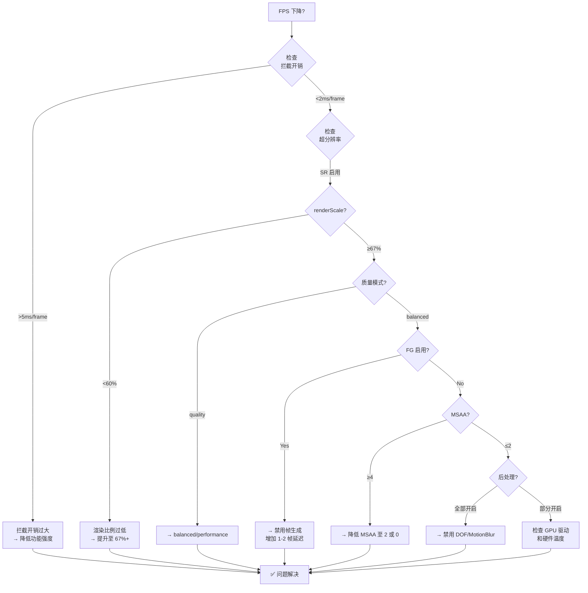
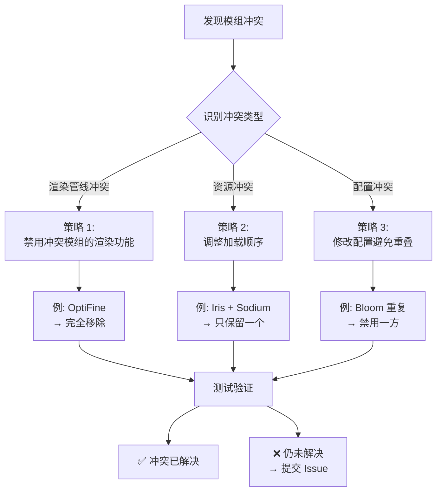
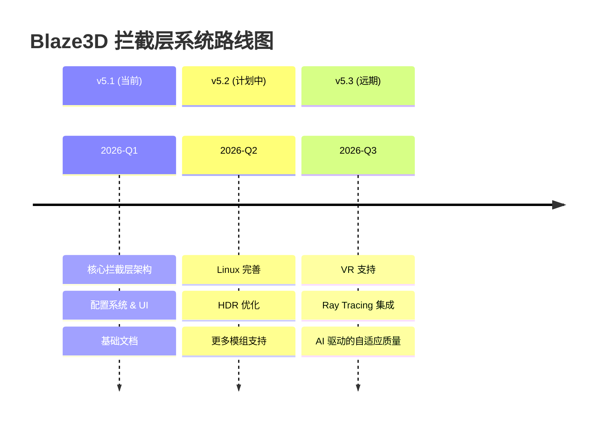

# Blaze3D 拦截层系统故障排查指南 (Troubleshooting)

> **版本**: 5.1.0
> **最后更新**: 2026-04-20
> **适用范围**: Renderium v5.1+
> **面向用户**: 开发者、高级用户、Modpack 制作者

---

## 目录

1. [快速诊断清单](#1-快速诊断清单)
2. [常见问题与解决方案](#2-常见问题与解决方案)
3. [日志分析与调试](#3-日志分析与调试)
4. [性能问题排查](#4-性能问题排查)
5. [兼容性问题](#5-兼容性问题)
6. [配置问题修复](#6-配置问题修复)
7. [已知限制与规避方案](#7-已知限制与规避方案)

---

## 1. 快速诊断清单

在深入排查之前，请先完成以下基础检查：

### ✅ 基础检查项

- [ ] **Renderium 版本确认**
  - 确认使用的是 v5.1 或更高版本（v5.0 不支持拦截层功能）
  - 检查方法：查看 `renderium.properties` 中的 `config.version` 字段

- [ ] **Java 版本兼容性**
  - 要求：Java 17+（推荐 Java 21）
  - 检查方法：`java -version`

- [ ] **模组加载顺序**
  - Renderium 应该在其他渲染模组（Sodium/Iris）**之后**加载
  - 检查方法：查看 `logs/latest.log` 中的 mod 加载顺序

- [ ] **配置文件完整性**
  - 确认 `config/renderium/renderium.properties` 存在且格式正确
  - 检查方法：打开文件，确认没有乱码或截断

- [ ] **GPU 驱动更新**
  - NVIDIA: 推荐 551.x+ (支持 DLSS 3.5+/FG)
  - AMD: 推荐 24.3.1+ (支持 FSR 3/AFMF)
  - Intel: 推荐 31.0.101.5186+ (支持 XeSS)

### 🔧 快速修复命令

```powershell
# PowerShell 中执行（Windows）

# 1. 删除缓存并重新生成配置
Remove-Item -Recurse -Force "config/renderium/cache" -ErrorAction SilentlyContinue
Rename-Item "config/renderium/renderium.properties" "renderium.properties.bak" -ErrorAction SilentlyContinue

# 2. 查看 Renderium 日志中的错误
Get-Content "logs/latest.log" | Select-String "ERROR|WARN" | Select-Object -Last 50

# 3. 检查 GPU 信息
Get-WmiObject Win32_VideoController | Select-Object Name, DriverVersion
```

---

## 2. 常见问题与解决方案

### 2.1 问题分类总览表

| 问题类别 | 典型症状 | 优先级 | 难度 |
|----------|----------|--------|------|
| **初始化失败** | 启动崩溃/黑屏 | 🔴 高 | ⭐ 简单 |
| **前拦截层未激活** | LOD/剔除不生效 | 🟡 中 | ⭐⭐ 中等 |
| **后拦截层失败** | 无超分辨率/帧生成效果 | 🔴 高 | ⭐⭐ 中等 |
| **Sodium 冲突** | 渲染异常/崩溃 | 🔴 高 | ⭐⭐⭐ 复杂 |
| **性能下降** | FPS 不升反降 | 🟡 中 | ⭐⭐⭐ 复杂 |
| **内存问题** | OOM/内存持续增长 | 🔴 高 | ⭐⭐⭐ 复杂 |
| **视觉伪影** | 图像撕裂/闪烁/模糊 | 🟡 中 | ⭐⭐⭐ 复杂 |

---

### 2.2 初始化失败

#### ❌ 症状：启动时崩溃，日志显示 `InitializationException`

**可能原因及解决方案**:

| # | 可能原因 | 诊断方法 | 解决方案 |
|---|----------|----------|----------|
| 1 | **Streamline SDK 缺失** | 检查 `libs/streamline/` 目录是否存在 | 下载 Streamline SDK 并放入正确位置 |
| 2 | **Java 版本过低** | 运行 `java -version` | 升级到 Java 17+ |
| 3 | **依赖冲突** | 查看日志中的 `NoClassDefFoundError` | 更新所有依赖到兼容版本 |
| 4 | **权限不足** | 检查是否有读写 config 目录的权限 | 以管理员身份运行或修改目录权限 |

**详细解决步骤**:

```bash
# 场景 1: Streamline SDK 缺失
# 错误日志示例:
# java.lang.UnsatisfiedLinkError: Unable to load library 'sl.interceptor'

# 解决方案:
# 1. 从 https://developer.nvidia.com/dlss/download 下载 Streamline SDK
# 2. 解压到 renderium/libs/streamline/
# 3. 确保 sl.interceptor.dll (Windows) 或 libsl.interceptor.so (Linux) 存在

# 场景 2: 依赖冲突
# 错误日志示例:
# java.lang.NoSuchMethodError: com.renderium.core.RenderiumCore.getInstance()

# 解决方案:
# 1. 删除 mods/ 目录下的旧版 Renderium jar
# 2. 下载最新版 Renderium v5.1+
# 3. 清除缓存：删除 config/renderium/cache/
# 4. 重启游戏
```

---

### 2.3 前拦截层未激活

#### ❌ 症状：
- LOD 效果不生效（远距离物体仍然高精度）
- 剔除优化不工作（Draw Call 数量未减少）
- 控制台显示 `[Pre-Interceptor] Not activated`

**可能原因及解决方案**:

| # | 可能原因 | 诊断方法 | 解决方案 |
|---|----------|----------|----------|
| 1 | **配置中禁用了前拦截层** | 检查 `interception.preInterceptor.enabled` | 设置为 `true` |
| 2 | **运行模式不匹配** | 检查当前是否为 COMPATIBILITY 模式 | 某些功能仅限 AGGRESSIVE 模式 |
| 3 | **模组检测失败** | 查看日志中的模组检测结果 | 确认模组版本受支持 |
| 4 | **Mixin 注入点失效** | 查看日志中的 Mixin 错误 | 更新 Mixin 配置或降级 MC 版本 |

**详细解决步骤**:

```properties
# ====== 检查配置文件 ======
# 打开 config/renderium/renderium.properties

# 确认以下配置项:
interception.preInterceptor.enabled=true        # 必须为 true
interception.preInterceptor.sodiumDetection=true # 如果使用 Sodium

# ====== 验证模式设置 ======
# 在游戏内按 F3+H 打开调试屏幕
# 查看左上角的 "Renderium Mode:" 字段
# 如果显示 "COMPATIBILITY"，部分高级功能不可用

# ====== 手动触发前拦截层 ======
# 在聊天框输入命令（如果启用了调试命令）:
# /renderium debug force-pre-intercept
# 观察控制台输出
```

**验证前拦截层是否工作**:

```java
// 在代码中添加调试输出（临时）
// 文件: DefaultPreInterceptor.java 的 intercept() 方法开头

LOGGER.info("[DEBUG] Pre-interceptor called");
LOGGER.info("[DEBUG] Context camera position: {}", context.getCameraPosition());
LOGGER.info("[DEBUG] Visible chunks count: {}", context.getVisibleChunks().size());

// 执行拦截后:
InterceptionResult result = doIntercept(context);
LOGGER.info("[DEBUG] Interception result: status={}, elapsed={}ms",
            result.getStatus(),
            result.getElapsedTimeNanos() / 1_000_000.0);
```

---

### 2.4 后拦截层失败

#### ❌ 症状：
- 超分辨率无效（画面模糊或无变化）
- 帧生成不工作（FPS 未提升）
- 后处理效果缺失（无 Bloom/DOF/MotionBlur）
- 日志显示 `[Post-Interceptor] Frame capture failed`

**可能原因及解决方案**:

| # | 可能原因 | 诊断方法 | 解决方案 |
|---|----------|----------|----------|
| 1 | **帧捕获方式不支持** | 检查 `frameCapture.method` 设置 | 尝试改为 `"fbo"` 或 `"swapchain"` |
| 2 | **FBO 句柄无效** | 查看日志中的 OpenGL 错误代码 | 更新显卡驱动或降低 MSAA |
| 3 | **超分辨率 SDK 未加载** | 查看日志中的 DLSS/FSR 初始化信息 | 安装对应的 SDK 或改用 FSR |
| 4 | **GPU 不支持帧生成** | 检查 GPU 型号（需要 RTX 40 系列） | 禁用帧生成或升级硬件 |
| 5 | **格式不匹配** | 检查 `frameCapture.format` 和 SR 输入格式 | 统一使用 RGBA16F 格式 |

**详细解决步骤**:

```bash
# ====== 步骤 1: 检查帧捕获状态 ======
# 在 renderium.properties 中启用详细日志:
debugMode=true
interception.debug.detailedLogging=true

# 重启游戏，观察日志输出:
# [INFO] [Post-Interceptor] Attempting frame capture...
# [INFO] [Post-Interceptor] Capture method: fbo
# [INFO] [Post-Interceptor] FBO ID: 12345
# [INFO] [Post-Interceptor] ✓ Frame captured successfully (1920x1080, RGBA16F)

# 如果看到:
# [ERROR] [Post-Interceptor] Failed to capture frame: Invalid FBO handle
# → 尝试将 interception.postInterceptor.frameCapture.method 改为 "auto"

# ====== 步骤 2: 检查超分辨率初始化 ======
# 日志中应出现:
# [INFO] [Streamline] DLSS feature initialized successfully
# [INFO] [Streamine] Feature: dlss-preset2 (Quality) loaded

# 如果出现:
# [WARN] [Streamline] DLSS not supported on this hardware
# → 将 preferredTechnology 改为 "fsr" 或 "xess"

# ====== 步骤 3: 检查帧生成支持 ======
# 仅 RTX 40 系列及以上 GPU 支持 DLSS-FG
# 使用以下命令检查 GPU:
nvidia-smi --query-gpu=name,driver_version --format=csv,noheader

# 输出示例:
# NVIDIA GeForce RTX 4080, 551.23
# → 支持 DLSS-FG ✅

# NVIDIA GeForce RTX 3090, 551.23
# → 不支持 DLSS-FG ❌ (可尝试 FSR-FG 或禁用 FG)
```

---

### 2.5 Sodium 冲突

#### ❌ 症状：
- 安装 Sodium 后渲染异常（紫屏/黑屏/纹理丢失）
- 崩溃并提示 `Sodium redirector failed`
- 性能急剧下降
- 日志显示 `Sodium version not supported`

**可能原因及解决方案**:

| # | 可能原因 | 诊断方法 | 解决方案 |
|---|----------|----------|----------|
| 1 | **Sodium 版本不受支持** | 查看日志中的 Sodium 版本号 | 升级/降级 Sodium 到 0.5.x 或 0.6.x |
| 2 | **FBO 截取冲突** | Sodium 使用了自定义 FBO 管理 | 设置 `fallbackMode=safe` |
| 3 | **Vulkan 路径冲突** | Sodium 使用 Vulkan 后端时的 API 冲突 | 强制 Sodium 使用 OpenGL 后端 |
| 4 | **其他模组干扰** | Iris/Oculus 与 Sodium 同时安装 | 只保留一个光影模组 |

**详细解决步骤**:

```properties
# ====== 方案 1: 使用安全回退模式 ======
# 在 renderium.properties 中:
interception.sodiumRedirector.fallbackMode=safe
# 这会禁用高级重定向功能，但保证基本兼容性

# ====== 方案 2: 禁用 Sodium 重定向器 ======
# 如果不需要 Sodium 特定优化:
interception.sodiumRedirector.enabled=false
# 这会让 Renderium 以通用方式处理模组输出

# ====== 方案 3: 添加 Sodium 到白名单 ======
# 如果使用的是非标准版本的 Sodium:
interception.sodiumRedirector.supportedVersions=0.5.x,0.6.x,0.7.x-custom
# 注意：自定义版本可能不完全兼容，需自行测试

# ====== 方案 4: 调整模组加载顺序 ======
# 在 Minecraft 的 mods/ 目录中:
# 确保文件名排序如下:
#   sodium-xxx.jar          (先加载)
#   renderium-xxx.jar       (后加载)
# 可以通过重命名实现:
#   _sodium-0.5.11.jar
#   renderium-5.1.0.jar
```

**Sodium 版本兼容性矩阵**:

| Sodium 版本 | 支持状态 | 推荐配置 | 备注 |
|-------------|----------|----------|------|
| **0.5.x** (0.5.0 - 0.5.11) | ✅ 完全支持 | `fallbackMode=auto` | 最稳定的版本 |
| **0.6.x** (0.6.0+) | ✅ 完全支持 | `fallbackMode=auto` | 推荐使用最新 0.6.x |
| **0.7.x** (Beta) | ⚠️ 实验性 | `fallbackMode=safe` | 可能存在未知问题 |
| **0.4.x 及更旧** | ❌ 不支持 | - | 请升级到 0.5.x+ |

---

### 2.6 性能问题：FPS 不升反降

#### ❌ 症状：
- 启用 Renderium 后 FPS 反而下降 10-30%
- 帧时间不稳定（卡顿感明显）
- CPU/GPU 占用率过高

**性能问题诊断流程图**:



**常见性能瓶颈及优化建议**:

| 瓶颈类型 | 症状 | 诊断方法 | 优化方案 |
|----------|------|----------|----------|
| **CPU 瓶颈** | CPU 占用率 >90%，GPU <70% | 任务管理器监控 | 减少剔除计算复杂度，关闭 LOD |
| **GPU 瓶颈** | GPU 占用率 >95% | MSI Afterburner / GPU-Z | 降低 renderScale，禁用 MSAA |
| **内存带宽瓶颈** | 显存占用 >85% | GPU-Z 显存监控 | 关闭 HDR 格式，使用 RGBA8 |
| **驱动开销** | 帧时间波动大 | NVIDIA Nsight | 更新驱动，禁用 Shader Cache |
| **同步等待** | CPU 等待 GPU 时间长 | RenderDoc 帧分析 | 启用异步捕获，调整 Triple Buffering |

**推荐的性能配置模板**:

```properties
# ====== 模板 1: 低端设备 (GTX 1060 / RX 580) ======
# 目标: 稳定 60 FPS，基本画质
interception.postInterceptor.superResolution.renderScale=0.75
interception.postInterceptor.superResolution.qualityMode=performance
interception.postInterceptor.superResolution.preferredTechnology=fsr
interception.postInterceptor.frameCapture.msaa=0
interception.postInterceptor.frameGeneration.enabled=false
interception.postInterceptor.postProcessing.dof.enabled=false
interception.postInterceptor.postProcessing.motionBlur.enabled=false

# ====== 模板 2: 中端设备 (RTX 3060 / RX 6700 XT) ======
# 目标: 80-100 FPS，平衡画质
interception.postInterceptor.superResolution.renderScale=0.667
interception.postInterceptor.superResolution.qualityMode=balanced
interception.postInterceptor.superResolution.preferredTechnology=auto
interception.postInterceptor.frameCapture.msaa=2
interception.postInterceptor.frameGeneration.enabled=false
interception.postInterceptor.postProcessing.bloom.intensity=0.4
interception.postInterceptor.postProcessing.motionBlur.intensity=0.25

# ====== 模板 3: 高端设备 (RTX 4080 / RX 7900 XTX) ======
# 目标: 120+ FPS，极致画质 + 帧生成
interception.postInterceptor.superResolution.renderScale=0.667
interception.postInterceptor.superResolution.qualityMode=quality
interception.postInterceptor.superResolution.preferredTechnology=dlss
interception.postInterceptor.frameCapture.msaa=4
interception.postInterceptor.frameGeneration.enabled=true
interception.postInterceptor.frameGeneration.targetFPS=120
interception.postInterceptor.postProcessing.bloom.enabled=true
interception.postInterceptor.postProcessing.dof.enabled=true
interception.postInterceptor.postProcessing.motionBlur.enabled=true
```

---

### 2.7 内存问题：OOM / 内存持续增长

#### ❌ 症状：
- 游戏运行一段时间后崩溃，提示 `OutOfMemoryError`
- 内存占用持续增长（从 2GB 增长到 8GB+）
- GC（垃圾回收）频繁导致卡顿

**诊断步骤**:

```bash
# ====== 步骤 1: 启用 JVM 内存监控 =====#
# 在启动参数中添加:
-Xmx4G -XX:+HeapDumpOnOutOfMemoryError -XX:HeapDumpPath=./heapdump.hprof

# ====== 步骤 2: 使用 VisualVM / JConsole 监控 =====#
# 连接到运行中的 Minecraft 进程
# 观察 Heap 内存曲线：
#   - 正常: 波动在 1-2GB 范围内，定期回收
#   - 异常: 持续上升，GC 无法释放

# ====== 步骤 3: 检查 Frame Buffer 泄漏 =====#
# 在 renderium.properties 中启用内存调试:
debugMode=true
interception.debug.memoryMonitoring=true
interception.debug.memoryWarningThresholdMB=500

# 日志中会出现:
# [WARN] [MemoryMonitor] Frame buffer pool size: 512MB (threshold: 500MB)
# [WARN] [MemoryMonitor] Possible memory leak detected!
```

**常见内存泄漏场景及修复**:

| # | 泄漏场景 | 症状 | 解决方案 |
|---|----------|------|----------|
| 1 | **Frame Buffer 未释放** | Triple Buffering 缓冲区堆积 | 减少缓冲区数量或手动调用 `release()` |
| 2 | **Texture 缓存无限增长** | 纹理内存持续增长 | 设置缓存上限 `textureCache.maxSizeMB=512` |
| 3 | **Shader 编译缓存泄漏** | 每帧编译新 Shader | 启用 Pipeline Cache 并限制大小 |
| 4 | **LOD 数据未清理** | Chunk 卸载后 LOD 数据残留 | 在 `onChunkUnload()` 时清理数据 |
| 5 | **Streamline 内部泄漏** | DLSS/FG 历史缓冲区增长 | 定期调用 `sl.reset()` 清理内部状态 |

**修复配置示例**:

```properties
# ====== 内存优化配置 ======

# 限制帧缓冲池大小
interception.postInterceptor.frameCapture.maxBufferPoolSizeMB=256

# 启用自动内存清理（每 N 帧执行一次）
interception.debug.autoMemoryCleanupIntervalFrames=600  # 每 10 秒

# 限制 LOD 数据缓存
interception.preInterceptor.lodInjection.maxCachedChunks=1024

# 启用显式 GC 提示（当内存超过阈值时）
interception.debug.forceGCThresholdMB=2048
```

---

### 2.8 视觉伪影问题

#### ❌ 症状：
- 图像边缘出现闪烁/锯齿
- 运动物体周围有光晕或鬼影
- 画面整体模糊或过度锐化
- 颜色失真或色调偏移

**伪影类型识别与修复**:

| 伪影类型 | 可能原因 | 定位方法 | 修复方案 |
|----------|----------|----------|----------|
| **闪烁 (Flickering)** | LOD 过渡不平滑 | 静态观察远距离物体 | 改用 `transitionMode=crossfade` |
| **鬼影 (Ghosting)** | 帧生成运动向量不准确 | 快速转动相机观察 | 降低 `sharpening` 或禁用 FG |
| **锯齿 (Aliasing)** | MSAA 不足或 SR 锐化过度 | 观察边缘线条 | 提高 MSAA 至 4 或 8 |
| **模糊 (Blurry)** | renderScale 过低或 SR 质量差 | 对比原始画面 | 提升 renderScale 至 75%+ |
| **色带 (Banding)** | HDR 色彩精度不足 | 观察渐变天空区域 | 使用 RGBA32F 格式 |
| **撕裂 (Tearing)** | VSync 未启用或帧 pacing 问题 | 快速移动时观察 | 启用 VSync 或 Fast Sync |

**视觉质量调优指南**:

```properties
# ====== 抗锯齿优化 ======
# 如果边缘锯齿明显:
interception.postInterceptor.frameCapture.msaa=8  # 最高 MSAA
interception.postInterceptor.superResolution.sharpening=0.15  # 降低锐化

# ====== 动态清晰度优化 ======
# 如果运动模糊导致鬼影:
interception.postInterceptor.postProcessing.motionBlur.enabled=false
# 或者降低强度:
interception.postInterceptor.postProcessing.motionBlur.intensity=0.15

# ====== 帧生成优化 ======
# 如果 FG 导致延迟感:
interception.postInterceptor.frameGeneration.enabled=false
# 或者降低目标 FPS:
interception.postInterceptor.frameGeneration.targetFPS=90

# ====== 色彩精度优化 ======
# 如果天空渐变色带明显:
interception.postInterceptor.frameCapture.format=RGBA32F  # 最高精度
# 注意: 会增加 ~50% 显存占用
```

---

## 3. 日志分析与调试

### 3.1 日志级别说明

| 级别 | 用途 | 示例场景 |
|------|------|----------|
| `SEVERE` | 致命错误，无法继续运行 | SDK 加载失败、OOM |
| `WARNING` | 可恢复的问题，功能受限 | 模组版本不支持、配置值非法 |
| `INFO` | 正常运行信息 | 初始化成功、配置加载完成 |
| `DEBUG` | 详细调试信息（需启用 debugMode） | 各阶段耗时、内部状态 |
| `FINEST` | 最详细的追踪信息 | 方法入参/出参、变量值 |

### 3.2 关键日志模式搜索

```bash
# ====== Windows PowerShell ======

# 搜索所有 ERROR 级别日志
Select-String -Path "logs/latest.log" -Pattern "ERROR" | Select-Object -Last 20

# 搜索拦截层相关日志
Select-String -Path "logs/latest.log" -Pattern "Intercept|PreInt|PostInt"

# 搜索性能相关日志
Select-String -Path "logs/latest.log" -Pattern "ms|overhead|elapsed"

# 搜索内存相关日志
Select-String -Path "logs/latest.log" -Pattern "memory|OOM|leak|GC"
```

### 3.3 典型正常日志输出

```
[INFO] [Renderium] Starting initialization... (v5.1.0)
[INFO] [ConfigMigration] Config migration check: current=v5.1, target=v5.1 (skipped)
[INFO] [Config] Loaded configuration from renderium.properties
[INFO] [Config] Validation passed (OK)
[INFO] [BackendInterceptor] Initializing dual-interception architecture...
[INFO] [Pre-Interceptor] Initialized (DefaultPreInterceptor)
[INFO] [Post-Interceptor] Initialized (DefaultPostInterceptor)
[INFO] [Streamline] SDK loaded successfully (version 2.3.20)
[INFO] [Streamline] Features available: dlss, fsr, xess
[INFO] [SodiumRedirector] Sodium 0.5.11 detected (compatible)
[INFO] [BackendInterceptor] ✓ Initialization complete (took 234ms)
...
[DEBUG] [Perf] Frame #12345:
  Pre-Interceptor: 0.82ms (ModDetect: 0.05ms cached, LOD: 0.31ms, Culling: 0.46ms)
  Blaze3D Render: 10.24ms
  Post-Interceptor: 3.56ms (Capture: 1.23ms, SR: 2.01ms, PP: 0.32ms)
  Total Overhead: 4.38ms (26.3% of frame time budget)
  FPS: 58.3 (target: 60)
```

### 3.4 典型错误日志及含义

```
# ====== 错误 1: SDK 加载失败 ======
[SEVERE] [Streamline] Failed to load native library: sl.interceptor
java.lang.UnsatisfiedLinkError: no sl.interceptor in java.library.path
→ 原因: Streamline SDK DLL/SO 文件缺失或路径错误
→ 解决: 下载 SDK 并放到 libs/ 或系统 PATH 目录

# ====== 错误 2: 配置验证失败 ======
[WARNING] [Config] Validation failed: interception config: superResolution.renderScale must be in range [0.5, 1.0];
→ 原因: renderScale 设置为非法值（如 0.3 或 1.5）
→ 解决: 修正配置值为 0.5-1.0 范围内的数值

# ====== 错误 3: 帧捕获失败 ======
[ERROR] [Post-Interceptor] Frame capture failed: GL_INVALID_OPERATION (0x0502)
→ 原因: OpenGL 状态机错误（可能在错误的上下文中调用 glReadPixels）
→ 解决: 检查 Mixin 注入点是否正确，或在正确的 GL 上下文中执行

# ====== 错误 4: Sodium 版本不支持 ======
[WARNING] [SodiumRedirector] Unsupported Sodium version: 0.7.0-beta1
[WARNING] [SodiumRedirector] Falling back to safe mode (no redirection)
→ 原因: 使用了 Beta 版 Sodium
→ 解决: 升级/降级 Sodium 到 0.5.x 或 0.6.x 稳定版

# ====== 错误 5: GPU 不支持某功能 ======
[WARN] [Streamline] DLSS-FG not supported on this GPU (GeForce RTX 3090)
[INFO] [FrameGenerator] Disabling frame generation (hardware requirement not met)
→ 原因: GPU 不满足帧生成的硬件要求（需要 RTX 40 系列）
→ 解决: 禁用帧生成或升级硬件
```

---

## 4. 性能问题排查

### 4.1 性能分析工具

| 工具 | 用途 | 平台 | 链接 |
|------|------|------|------|
| **NVIDIA Nsight Graphics** | GPU 性能分析、帧调试 | Windows | developer.nvidia.com/nsight-graphics |
| **AMD Radeon Performance Analyzer** | AMD GPU 分析 | Windows/Linux | gpuopen.com/tools |
| **RenderDoc** | 帧捕获、API 调试 | 全平台 | renderdoc.org |
| **VisualVM / JProfiler** | JVM 内存/CPU 分析 | 全平台 | visualvm.github.io |
| **Minecraft Debug Pie Chart** | 渲染阶段耗时分布 | MC 内置 | F3+Alt 组合键 |

### 4.2 性能数据收集脚本

```powershell
# ====== perf-collect.ps1 ======
# 自动收集性能数据的 PowerShell 脚本
# 用法: .\perf-collect.ps1 -DurationSeconds 60 -OutputFile perf-log.txt

param(
    [int]$DurationSeconds = 60,
    [string]$OutputFile = "perf-log.txt"
)

$startTime = Get-Date
$results = @()

Write-Host "📊 开始性能数据采集 ($DurationSeconds 秒)..."

for ($i = 0; $i -lt $DurationSeconds; $i++) {
    # 从 Minecraft 日志读取最新的帧数据（模拟）
    $logLine = Get-Content "logs/latest.log" -Tail 1
    
    if ($logLine -match "FPS:\s*([\d.]+).*Overhead:\s*([\d.]+)ms") {
        $fps = [double]$Matches[1].Value
        $overhead = [double]$Matches[2].Value
        
        $results += [PSCustomObject]@{
            Time = $i
            FPS = $fps
            OverheadMs = $overhead
        }
    }
    
    Start-Sleep -Milliseconds 1000
}

# 计算统计信息
$avgFPS = ($results | Measure-Object -Property FPS -Average).Average
$maxOverhead = ($results | Measure-Object -Property OverheadMs -Maximum).Maximum
$minFPS = ($results | Measure-Object -Property FPS -Minimum).Minimum

# 输出结果
$output = @"
===== 性能报告 =====
采集时长: $DurationSeconds 秒
平均 FPS: $([math]::Round($avgFPS, 1))
最低 FPS: $minFPS
最大拦截开销: $([math]::Round($maxOverhead, 2)) ms
采样数: $($results.Count)
"@

$output | Out-File -FilePath $OutputFile
Write-Host "✅ 报告已保存到: $OutputFile"
Write-Host $output
```

### 4.3 性能基准对比

创建基线性能文件用于回归测试：

```properties
# ====== baseline-perf.properties ======
# 记录理想环境下的性能指标（用于后续对比）
baseline.timestamp=2026-04-20
baseline.hardware=RTX 4080, i9-13900K, 32GB RAM
baseline.mcVersion=1.21.1
baseline.renderiumVersion=5.1.0

# 平均值（1000 帧采样）
baseline.avgFPS=145.2
baseline.avgFrameTime=6.89ms
baseline.p99FrameTime=12.34ms

# 拦截层开销
baseline.preInterceptorAvgMs=0.78
baseline.postInterceptorAvgMs=3.21
baseline.totalOverheadPct=24.8

# GPU 指标
baseline.gpuUtilizationPct=82.3
baseline.vramUsageMB=3856
baseline.drawCalls=1247

# 对比阈值（超过此值视为回归）
regression.threshold.fpsDropPercent=10
regression.threshold.overheadIncreaseMs=2.0
regression.threshold.vramIncreaseMB=256
```

---

## 5. 兼容性问题

### 5.1 已知兼容模组列表

| 模组名称 | 兼容版本 | 兼容性等级 | 特殊说明 |
|----------|----------|------------|----------|
| **Sodium** | 0.5.x, 0.6.x | ✅ 完全支持 | 需要启用 Sodium Redirector |
| **Iris** | 1.7.x, 1.8.x | ✅ 完全支持 | 自动检测光影配置 |
| **Oculus** | 1.19.x, 1.20.x | ⚠️ 实验性 | 部分功能可能受限 |
| **OptiFine** | 所有版本 | ❌ 不支持 | 架构冲突，请勿同时使用 |
| **Canvas/Colormatic** | 最新版 | ⚠️ 需测试 | 可能与后处理冲突 |
| **Sodium Extra** | 0.5.x | ✅ 支持 | 无特殊要求 |
| **Lithium** | 所有版本 | ✅ 支持 | 无冲突 |

### 5.2 模组冲突解决策略



---

## 6. 配置问题修复

### 6.1 配置文件损坏恢复

```bash
# ====== 方法 1: 自动恢复默认值 ======
# 删除现有配置文件，下次启动时会自动生成默认配置
del "config\renderium\renderium.properties"

# ====== 方法 2: 手动重建最小配置 =====#
# 创建新的 renderium.properties，只包含必要字段:
@'
config.version=5.1
enabled=true
debugMode=false

interception.preInterceptor.enabled=true
interception.postInterceptor.enabled=true
interception.sodiumRedirector.enabled=true
'@ | Out-File "config\renderium\renderium.properties" -Encoding UTF8

# ====== 方法 3: 使用备份恢复 =====#
# 如果有之前的备份:
copy "config\renderium\renderium.properties.bak.*" "config\renderium\renderium.properties"
```

### 6.2 配置迁移失败处理

如果 `ConfigMigration.migrate()` 返回失败：

```java
// 手动执行迁移逻辑（紧急情况）
public void emergencyMigrate(Path configFile) {
    Properties props = new Properties();
    
    try (Reader reader = Files.newBufferedReader(configFile)) {
        props.load(reader);
    } catch (IOException e) {
        LOGGER.severe("无法读取配置文件: " + e.getMessage());
        return;
    }
    
    // 手动添加所有缺失的拦截层配置字段
    String[][] defaults = {
        {"interception.preInterceptor.enabled", "true"},
        {"interception.preInterceptor.sodiumDetection", "true"},
        // ... （完整列表见 ConfigMigration.java）
    };
    
    for (String[] entry : defaults) {
        if (!props.containsKey(entry[0])) {
            props.setProperty(entry[0], entry[1]);
            LOGGER.info("Emergency migration: added " + entry[0]);
        }
    }
    
    // 保存
    try (Writer writer = Files.newBufferedWriter(configFile)) {
        props.store(writer, "Renderium Configuration (emergency migrated)");
        LOGGER.info("✓ 紧急迁移完成");
    } catch (IOException e) {
        LOGGER.severe("无法保存配置: " + e.getMessage());
    }
}
```

---

## 7. 已知限制与规避方案

### 7.1 当前版本的限制

| 限制编号 | 描述 | 影响范围 | 规避方案 | 计划修复版本 |
|----------|------|----------|----------|--------------|
| **LIMIT-001** | 帧生成仅支持 RTX 40 系列 GPU | FG 功能不可用 | 使用 FSR-FG（质量较低）或禁用 FG | v5.2 (待 NVIDIA 开放) |
| **LIMIT-002** | Sodium 0.7.x 实验性支持 | 可能出现渲染异常 | 降级到 0.6.x 或使用 safe mode | v5.1.1 |
| **LIMIT-003** | 异步帧捕获在某些驱动上有 Bug | 异步模式下崩溃 | 禁用 async (`async=false`) | v5.1.2 |
| **LIMIT-004** | HDR 格式下显存占用较高 (~200MB) | 低显存 GPU OOM | 使用 RGBA8 格式（损失 HDR） | v5.2 (优化压缩) |
| **LIMIT-005** | Linux 下某些 Compositor 兼容性问题 | Wayland 下可能出现闪烁 | 使用 X11 或设置环境变量 | v5.2 |

### 7.2 功能路线图



---

## 附录

### A. 获取帮助的渠道

| 渠道 | 说明 | 响应时间 |
|------|------|----------|
| **GitHub Issues** | 提交 Bug Report 或 Feature Request | 1-3 个工作日 |
| **Discord 社区** | 实时讨论和问答 | 数分钟~数小时 |
| **Wiki 文档** | 自助查找解决方案 | 即时 |
| **邮件支持** | 企业级技术支持 | 24 小时内 |

**提交 Issue 时的必填信息**:

```markdown
## 环境信息
- 操作系统: Windows 11 / Ubuntu 22.04 / macOS 14
- Java 版本: Java 21.0.2 (Eclipse Temurin)
- Minecraft 版本: 1.21.1
- Renderium 版本: 5.1.0
- GPU 型号 + 驱动: RTX 4080 / Driver 551.23
- 已安装模组列表: Sodium 0.5.11, Iris 1.7.2, ...

## 问题描述
（详细描述遇到的问题，包括复现步骤）

## 期望行为
（描述你期望的正确行为）

## 实际行为
（描述实际发生的错误行为）

## 日志片段
（粘贴相关的错误日志，约 50-100 行）

## 截图/录屏
（如果有视觉问题，请提供截图或录屏链接）
```

### B. 常用调试命令

在游戏中（如果启用了调试命令）：

```bash
# 显示当前拦截层状态
/renderium status

# 手动触发前拦截层（测试用）
/renderium debug force-pre-intercept

# 手动触发后拦截层（测试用）
/renderium debug force-post-intercept

# 导出当前配置到文件
/renderium config export

# 重新加载配置（热重载）
/renderium config reload

# 显示性能统计（最近 1000 帧）
/renderium perf stats

# 重置所有拦截层配置为默认值
/renderium config reset-interception

# 启用/禁用特定功能
/renderium set preInterceptor.enabled true
/renderium set postInterceptor.superResolution.enabled false
```

### C. 性能优化速查表

| 目标 | 配置项 | 推荐值 | 预期效果 |
|------|--------|--------|----------|
| **最高 FPS** | renderScale | 0.5 | +40-60% FPS，画质较低 |
| **最佳画质** | qualityMode | quality | 最佳视觉效果，FPS 较低 |
| **平衡体验** | renderScale + qualityMode | 0.667 + balanced | 推荐，兼顾两者 |
| **最低延迟** | frameGeneration | disabled | 减少 1-2 帧输入延迟 |
| **最高流畅度** | frameGeneration + targetFPS | enabled + 144 | 丝般顺滑，需高端 GPU |
| **最少显存** | format + msaa | RGBA8 + 0 | 节省 ~100MB 显存 |
| **最稳定** | fallbackMode | safe | 最大兼容性，牺牲部分功能 |

---

> 📝 **最后更新**: 2026-04-20
> 🔄 **下次审查**: 2026-07-20（或随版本发布更新）
> 👤 **维护者**: Renderium Team
