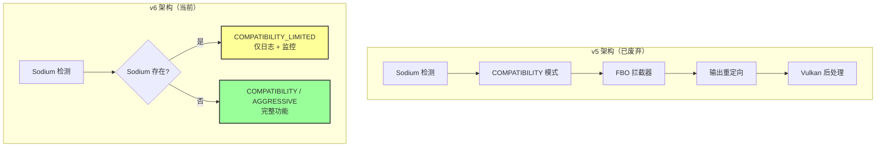
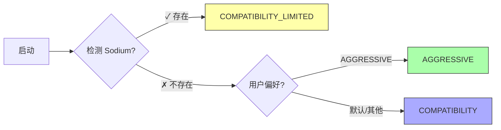

# Renderium v6 迁移指南 - Sodium 策略变更

> **版本**: 6.0
> **日期**: 2026-04-20
> **状态**: 正式发布

---

## 📋 目录

- [1. 概述](#1-概述)
- [2. v5 → v6 核心变更](#2-v5--v6-核心变更)
- [3. 受影响的 API 列表](#3-受影响的-api-列表)
- [4. 迁移指南](#4-迁移指南)
- [5. 模式变更详解](#5-模式变更详解)
- [6. FAQ 常见问题](#6-faq-常见问题)

---

## 1. 概述

### 1.1 变更背景

Renderium v6 对 Sodium 集成策略进行了重大调整：

| 维度 | v5 策略 | v6 策略 |
|------|---------|---------|
| **集成深度** | 深度集成（FBO 拦截、输出重定向） | 仅检测 + 日志 |
| **兼容模式** | COMPATIBILITY（完整后处理） | COMPATIBILITY_LIMITED（功能受限） |
| **代码量** | 6 个核心类 + 多个 Mixin | 保留检测逻辑，标记旧代码为 `@Deprecated` |
| **用户建议** | 可与 Sodium 共存使用 | **建议二选一** |

### 1.2 设计理由

**Sodium 是优秀的优化模组**，与 Renderium 在以下方面存在功能重叠：
- ✅ 区块网格构建优化
- ✅ 面剔除算法
- ✅ 顶点格式压缩
- ✅ 渲染后端优化

v6 策略认为：**同时使用两个优化模组会导致**：
1. 复杂性激增（FBO 拦截、GL-Vulkan 互操作）
2. 稳定性风险（Mixin 冲突、时序问题）
3. 性能不确定性（双重优化的叠加效应难以预测）

因此，v6 建议：**用户在 Sodium 和 Renderium 之间二选一**。

### 1.3 兼容性承诺

- ✅ **不破坏现有 API 签名**（仅添加注解和文档）
- ✅ **不删除任何文件**（仅标记为 `@Deprecated`）
- ✅ **编译无错误**（deprecated 警告可接受）
- ✅ **向后兼容**（现有代码可继续运行，但会收到废弃警告）

---

## 2. v5 → v6 核心变更

### 2.1 架构变更图



### 2.2 核心类变更

| 类名 | 包路径 | v6 变更 | 替代方案 |
|------|--------|---------|----------|
| `SodiumDetector` | `interception.sodium` | `@Deprecated(v6)` | `RenderiumDualModeManager.isSodiumPresent()` |
| `SodiumApiMapping` | `interception.sodium` | `@Deprecated(v6)` | 无需替代（不再反射调用） |
| `SodiumFBOInterceptor` | `interception.sodium` | `@Deprecated(v6)` | `RenderiumLODSystem` |
| `SodiumFBOCapturer` | `interception.sodium` | `@Deprecated(v6)` | `RenderBackend` |
| `SodiumOutputRedirector` | `interception.sodium` | `@Deprecated(v6)` | `RenderiumDualModeManager` |
| `SodiumFBOInterceptor` | `compatibility` | `@Deprecated(v6)` | 无需替代（不再拦截） |
| `RenderiumDualModeManager` | `core` | **重构** | 自身（简化版） |
| `RenderiumMode` | `core` | **扩展** | 新增 `COMPATIBILITY_LIMITED` |

### 2.3 行为变更对比

#### 模式决策算法

```java
// v5 算法
if (sodiumPresent) {
    return RenderiumMode.COMPATIBILITY; // 启用 FBO 拦截 + 后处理
}

// v6 算法
if (sodiumPresent) {
    LOGGER.warning("检测到 Sodium - 建议卸载以获得最佳体验");
    return RenderiumMode.COMPATIBILITY_LIMITED; // 仅监控，不拦截
}
```

#### 组件初始化

```java
// v5: 初始化完整的 FBO 拦截链
this.fboInterceptor = SodiumFBOInterceptor.getInstance();
this.fboInterceptor.initialize(true);

// v6: 不再初始化任何 Sodium 相关组件
// v6: 仅记录日志并切换到受限模式
```

---

## 3. 受影响的 API 列表

### 3.1 已废弃的公共方法

| 方法名 | 所属类 | 废弃原因 | 迁移建议 |
|--------|--------|----------|----------|
| `getInstance()` | `SodiumDetector` | 不再需要独立检测 | 使用 `RenderiumDualModeManager.getInstance()` |
| `detect()` | `SodiumDetector` | 功能已内置 | 使用 `isSodiumPresent()` |
| `getApiForVersion()` | `SodiumApiMapping` | 不再反射调用 | 删除调用代码 |
| `captureFBOContent()` | `SodiumOutputRedirector` | 不再捕获 FBO | 删除调用代码 |
| `initialize(boolean)` | `compatibility.SodiumFBOInterceptor` | 不再拦截 | 删除调用代码 |
| `initializeCompatibilityComponents()` | `RenderiumDualModeManager` | 已空实现 | 删除调用代码 |
| `shutdownCompatibilityComponents()` | `RenderiumDualModeManager` | 已空实现 | 删除调用代码 |
| `getFboInterceptor()` | `RenderiumDualModeManager` | 始终返回 null | 删除调用代码 |
| `isFBOInterceptionReady()` | `RenderiumDualModeManager` | 始终返回 false | 删除调用代码 |
| `usesSodiumOptimizations()` | `RenderiumMode` | 始终返回 false | 删除调用代码 |

### 3.2 新增的公共 API

| 方法名 | 所属类 | 用途 |
|--------|--------|------|
| `isFullCompatible()` | `RenderiumMode` | 检查是否为完全兼容模式（非受限） |
| `isCompatibilityLimited()` | `RenderiumMode` | 检查是否为受限兼容模式 |
| `getId()` | `RenderiumMode` | 获取模式标识符（新增字段） |

---

## 4. 迁移指南

### 4.1 场景 1：仅使用 Renderium（推荐）

**适用情况**：纯净环境，追求极致性能

```java
// ✅ v6 推荐做法
RenderiumDualModeManager manager = RenderiumDualModeManager.getInstance();

// 检查当前模式
if (manager.getCurrentMode() == RenderiumMode.AGGRESSIVE) {
    // 完整优化功能可用
    LOGGER.info("狂暴模式已启用");
} else if (manager.getCurrentMode() == RenderiumMode.COMPATIBILITY) {
    // 兼容模式（无 Sodium）
    LOGGER.info("兼容模式已启用");
}
```

**配置建议**：
- 卸载 Sodium（如果之前安装过）
- 设置 `renderium.mode=AGGRESSIVE` 获得最佳性能
- 或保持默认 `renderium.mode=COMPATIBILITY` 获得稳定体验

### 4.2 场景 2：仅使用 Sodium

**适用情况**：已经习惯 Sodium 的用户

```java
// ✅ 如果选择使用 Sodium，Renderium 会自动降级
RenderiumDualModeManager manager = RenderiumDualModeManager.getLogger();

// 检测到共存时的行为
if (manager.isSodiumPresent()) {
    assert manager.getCurrentMode() == RenderiumMode.COMPATIBILITY_LIMITED;
    LOGGER.info("Renderium 已进入受限模式，不会干扰 Sodium");
}
```

**注意事项**：
- Renderium 会自动降级到 `COMPATIBILITY_LIMITED`
- 不会进行任何 FBO 拦截或后处理
- 仅提供基础日志记录
- **建议完全卸载 Renderium** 以避免不必要的模组加载开销

### 4.3 场景 3：从 v5 迁移现有代码

#### 移除 FBO 拦截相关代码

```java
// ❌ v5 代码（已废弃）
SodiumFBOInterceptor interceptor = SodiumFBOInterceptor.getInstance();
interceptor.initialize(true);
if (interceptor.isEnabled()) {
    interceptor.onSodiumTerrainRenderComplete(fboId, width, height);
}

// ✅ v6 替代方案（删除上述代码即可）
// v6 不再拦截 FBO，如需后处理请使用原生 Vulkan 管线
```

#### 更新模式检查逻辑

```java
// ❌ v5 代码
if (mode == RenderiumMode.COMPATIBILITY) {
    // 启用 FBO 拦截...
}

// ✅ v6 代码
switch (mode) {
    case COMPATIBILITY -> {
        // 完整后处理（无 Sodium 时）
    }
    case COMPATIBILITY_LIMITED -> {
        // 受限模式（有 Sodium 时）- 仅日志
        LOGGER.warning("当前为受限兼容模式，功能不可用");
    }
    case AGGRESSIVE -> {
        // 完整优化功能
    }
}
```

#### 移除 Sodium 检测器依赖

```java
// ❌ v5 代码
SodiumDetector detector = SodiumDetector.getInstance();
detector.detect();
if (detector.isSodiumPresent()) {
    String version = detector.getSodiumVersion();
    // ...
}

// ✅ v6 替代方案
RenderiumDualModeManager manager = RenderiumDualModeManager.getInstance();
if (manager.isSodiumPresent()) {
    Optional<String> version = manager.getSodiumVersion();
    // ...
}
```

---

## 5. 模式变更详解

### 5.1 三模式架构总览



### 5.2 COMPATIBILITY_LIMITED 模式特性

| 能力 | 是否支持 | 说明 |
|------|----------|------|
| FBO 拦截 | ❌ | 不拦截 Sodium 输出 |
| 输出重定向 | ❌ | 不重定向到 Vulkan 后处理 |
| 后处理增强 | ❌ | 避免 DLSS/XeSS/FSR 与 Sodium 冲突 |
| Blaze3D 微调 | ⚠️ 有限 | 仅非侵入式性能监控 |
| Chunk 劫持 | ❌ | 不劫持底层结构 |
| 日志记录 | ✅ | 记录 Sodium 版本和运行状态 |
| 用户提示 | ✅ | 建议卸载 Sodium |

### 5.3 Mixin 优先级调整

```java
// v6 Mixin 优先级策略
public int getMixinPriority() {
    return switch (currentMode) {
        case COMPATIBILITY          -> 1000; // 中等优先级
        case COMPATIBILITY_LIMITED  -> 1500; // 低优先级（让 Sodium 先加载）
        case AGGRESSIVE             -> 500;  // 高优先级（尽早注入）
    };
}
```

**设计意图**：
- `COMPATIBILITY_LIMITED` 使用最低优先级，确保 **Sodium 的 Mixin 优先加载**
- 避免与 Sodium 的 Mixin 产生加载顺序冲突

---

## 6. FAQ 常见问题

### Q1: 为什么 v6 不再支持 Sodium 集成？

**A**: 经过 v5 的实践，我们发现：
1. **复杂性过高**：GL-Vulkan 互操作、FBO 同步、帧时序控制等技术挑战巨大
2. **稳定性风险**：两个优化模组的 Mixin 可能产生不可预测的交互
3. **收益有限**：Sodium 本身已经很优秀，在其上再做一层拦截的性价比不高

**哲学层面**：Renderium 的定位是"独立的极致优化引擎"，而非"Sodium 的后处理插件"。

### Q2: 我必须卸载 Sodium 才能使用 Renderium 吗？

**A**: 不是必须的，但**强烈建议**。

如果不卸载：
- ✅ Renderium 可以正常运行（自动降级到 `COMPATIBILITY_LIMITED`）
- ❌ 无法使用 Renderium 的后处理、超分辨率等功能
- ⚠️ 可能会有轻微的性能开销（额外的检测逻辑）

### Q3: 我的项目依赖了旧的 Sodium API，怎么办？

**A**: 按照以下步骤迁移：

1. **立即行动**：将所有对 `interception.sodium.*` 和 `compatibility.SodiumFBOInterceptor` 的调用替换为新 API
2. **短期方案**：继续使用旧代码（会收到 deprecated 警告），但尽快迁移
3. **长期规划**：v7 将物理删除这些类，届时将无法编译

### Q4: COMPATIBILITY_LIMITED 模式下能做什么？

**A**: 该模式下可以：
- ✅ 查看 Sodium 版本信息
- ✅ 记录运行日志
- ✅ 接收用户通知（提示卸载 Sodium）

不能做：
- ❌ FBO 拦截
- ❌ 输出重定向
- ❌ 后处理增强
- ❌ 超分辨率/帧生成

### Q5: 如何判断当前运行在哪种模式？

**A**:

```java
RenderiumDualModeManager manager = RenderiumDualModeManager.getInstance();
RenderiumMode mode = manager.getCurrentMode();

LOGGER.info("当前模式: " + mode.getDisplayName());
LOGGER.info("模式 ID: " + mode.getId());
LOGGER.info("Sodium 存在: " + manager.isSodiumPresent());

if (mode.isCompatibilityLimited()) {
    LOGGER.warning("⚠️ 当前为受限兼容模式，建议卸载 Sodium");
}
```

### Q6: 未来的版本会完全删除 Sodium 相关代码吗？

**A**: 是的。

时间线：
- **v6.0**（当前）：标记为 `@Deprecated(since="6.0", forRemoval=true)`
- **v7.0**（计划）：**物理删除**所有 `@Deprecated` 类
- **过渡期**：v6.x 维护版本将继续保留，但不修复相关 bug

**建议**：在 v6 尽快完成迁移，避免 v7 编译失败。

### Q7: 如果我发现了 Bug 或有改进建议怎么办？

**A**:
- 对于 **v6 新功能**（如 `COMPATIBILITY_LIMITED`）：欢迎提 Issue 和 PR
- 对于 **废弃的 Sodium 功能**：我们将不再接受新的 feature request，仅修复 critical bug

---

## 附录 A: 快速迁移清单

- [ ] 移除所有 `import com.renderium.interception.sodium.*` 语句
- [ ] 移除所有 `import com.renderium.compatibility.SodiumFBOInterceptor` 语句
- [ ] 将 `SodiumDetector.getInstance().detect()` 替换为 `RenderiumDualModeManager.getInstance().isSodiumPresent()`
- [ ] 将 `SodiumFBOInterceptor.getInstance().initialize()` 调用删除
- [ ] 将 `SodiumOutputRedirector.getInstance().initialize()` 调用删除
- [ ] 更新 `switch (mode)` 语句，添加 `case COMPATIBILITY_LIMITED` 分支
- [ ] 处理编译器警告（可选：添加 `@SuppressWarnings("deprecation")` 并添加 TODO 注释）
- [ ] 测试在有/无 Sodium 环境下的行为
- [ ] 更新项目文档，说明 v6 策略变更

---

## 附录 B: 相关文档链接

- [SodiumAuditReport.java](../main/java/com/renderium/audit/SodiumAuditReport.java) - 审计报告工具
- [RenderiumDualModeManager.java](../main/java/com/renderium/core/RenderiumDualModeManager.java) - 三轨制管理器
- [RenderiumMode.java](../main/java/com/renderium/core/RenderiumMode.java) - 模式枚举定义
- [v5 → v6 设计决策文档](./design-decision-v6-sodium.md) （待创建）

---

> **最后更新**: 2026-04-20
> **维护者**: Renderium Team
> **反馈渠道**: [GitHub Issues](https://github.com/renderium/renderium/issues)
