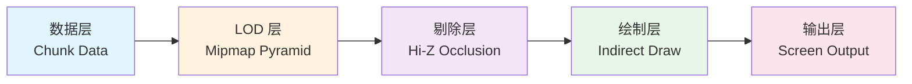
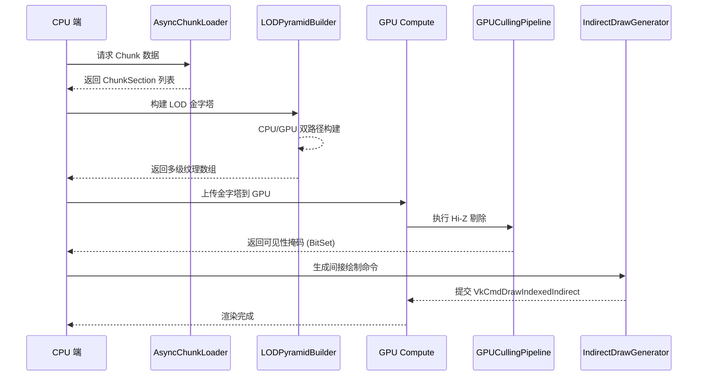
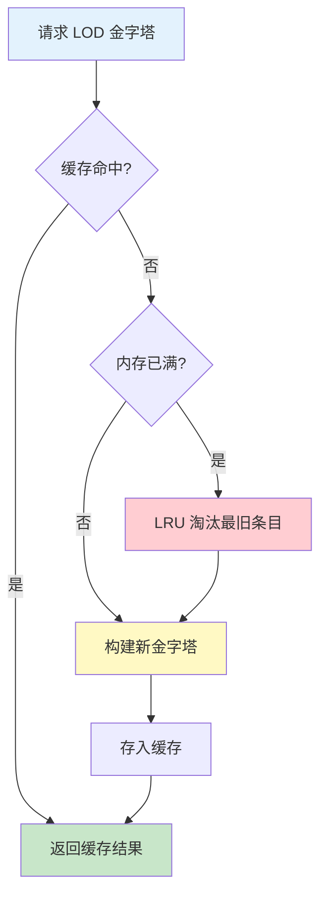
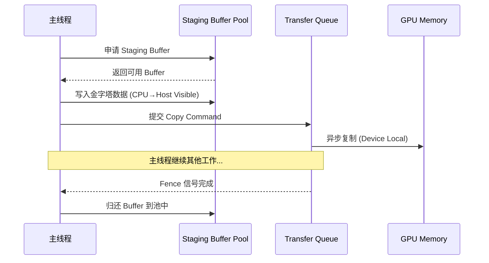
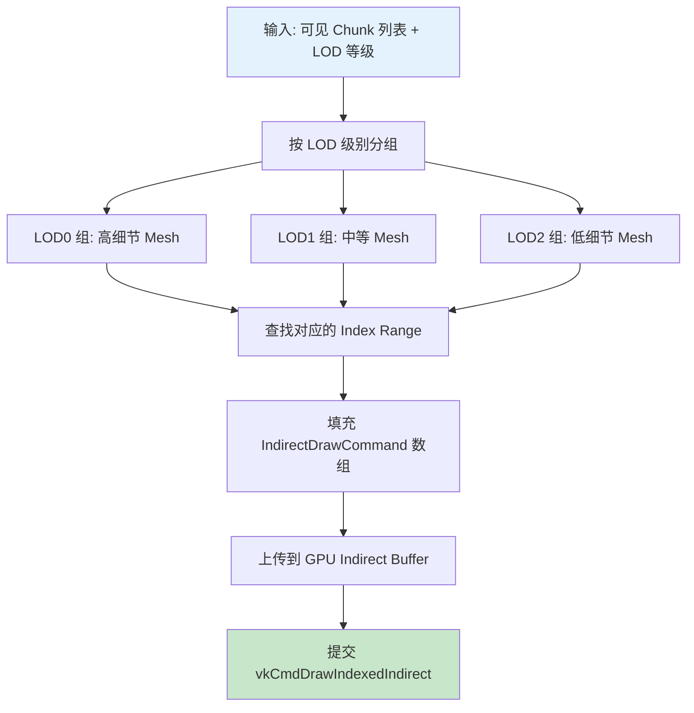
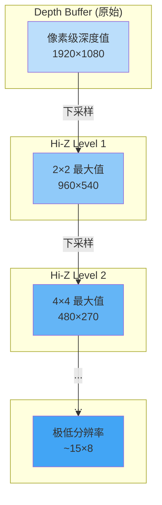

# Voxy 架构学习文档 - Renderium v6 Phase 2

> **文档状态**: ✅ 当前使用
> **创建日期**: 2026-04-20
> **适用阶段**: Renderium v6 Phase 2 - 超视距 LOD 系统核心架构
> **重要声明**: 我们学习 Voxy 的**架构思想**而非直接复制代码！

---

## 一、Voxy 项目概述与目标

### 1.1 项目背景

Voxy 是一个实验性的 **Voxel（体素）渲染引擎**，专注于解决大规模体素场景的实时渲染问题。其核心目标是：

- **超远距离渲染**: 支持 1024+ chunks 的渲染距离
- **高性能**: 在普通硬件上保持 60+ FPS
- **流式加载**: 动态加载/卸载远处区块，控制内存占用
- **GPU-Driven**: 充分利用现代 GPU 的并行计算能力

### 1.2 核心设计哲学



**关键思想**: 将渲染管线分解为独立的、可并行的阶段，每个阶段都可以异步执行，最大化 CPU/GPU 利用率。

### 1.3 与 Minecraft 渲染的关系

| 特性 | Vanilla Minecraft | Sodium | Voxy (概念) | Renderium v6 |
|------|-------------------|--------|-------------|--------------|
| 最大渲染距离 | 32 chunks | 512 chunks | 1024+ chunks | 1024+ chunks |
| LOD 系统 | 无 | 基础距离 LOD | Mipmap Pyramid | Mipmap Pyramid |
| 遮挡剔除 | 无 | 图遍历 | Hi-Z Map | Hi-Z + Frustum |
| GPU-Driven | ❌ | 部分 | 完全 | 完全 (AGGRESSIVE) |
| 流式上传 | ❌ | 同步 | 异步 | 异步 |

---

## 二、核心架构模式分析

### 2.1 整体架构流程



### 2.2 模块职责划分

#### 模块 1: 数据提供层 (Data Provider)
- **职责**: 提供原始 Chunk 数据
- **接口**: `AsyncChunkLoader` / `RealDataProvider`
- **性能要求**: 异步加载，不阻塞主线程
- **输出**: `List<ChunkSection>` 或类似数据结构

#### 模块 2: LOD 金字塔构建器 (LOD Pyramid Builder)
- **职责**: 将高分辨率 Chunk 数据降采样为多级 LOD
- **算法**: Mipmap 下采样（每级降低 4x 分辨率）
- **双路径支持**:
  - **CPU 路径**: 适用于兼容模式，可靠但较慢
  - **GPU 路径**: 使用 Compute Shader 加速，适用于狂暴模式
- **缓存策略**: LRU 缓存最近使用的金字塔结果
- **输出**: 多级纹理数组 (`Texture[]` 或 `byte[][][]`)

#### 模块 3: GPU 剔除管线 (GPU Culling Pipeline)
- **职责**: 高效剔除不可见/被遮挡的区块
- **核心技术**:
  - **Hi-Z Occlusion**: 基于深度金字塔的遮挡查询
  - **Frustum Culling**: 视锥体剔除
  - **Distance Culling**: 距离剔除
- **输出**: 可见性掩码 (`BitSet visibleMask`)

#### 模块 4: 间接绘制生成器 (Indirect Draw Generator)
- **职责**: 根据可见性掩码和 LOD 等级生成绘制命令
- **技术**: Vulkan `VkCmdDrawIndexedIndirect`
- **优势**: 
  - 单次 Dispatch 处理数千个 DrawCall
  - CPU 开销接近零
  - GPU 自行决定绘制顺序和数量

---

## 三、Mipmap LOD Pyramid 设计原理

### 3.1 什么是 Mipmap 金字塔？

Mipmap（Multum in Parvo，拉丁语"小中见大"）是一种**多分辨率纹理层次结构**：
- **LOD0**: 原始分辨率（完整细节）
- **LOD1**: 1/4 分辨率（宽高各减半）
- **LOD2**: 1/16 分辨率
- ...
- **LODN**: 极低分辨率（仅保留轮廓）

### 3.2 Voxy 的 3D Mipmap 设计

对于 **16×16×16 blocks per section** 的 Chunk 数据：

```
┌─────────────────────────────────────────────────────────────┐
│                    LOD 金字塔结构                             │
├───────┬──────────┬─────────────┬────────────┬───────────────┤
│ Level │ 分辨率   │ Block 数量  │ 内存估算   │ 适用距离       │
├───────┼──────────┼─────────────┼────────────┼───────────────┤
│ LOD0  │ 16×16×16 │ 4096 blocks │ ~64 KB     │ <32 chunks    │
│ LOD1  │ 8×8×8    │ 512 blocks  │ ~8 KB      │ 32-64 chunks  │
│ LOD2  │ 4×4×4    │ 64 blocks   │ ~1 KB      │ 64-128 chunks │
│ LOD3  │ 2×2×2    │ 8 blocks    │ ~128 B     │ 128-256 chunks│
│ LOD4  │ 1×1×1    │ 1 block     │ ~16 B      │ >256 chunks   │
└───────┴──────────┴─────────────┴────────────┴───────────────┘
```

**内存节省效果**:
- LOD0 → LOD4: 内存减少 **4096 倍**
- 对于 1000 个 distant chunks:
  - 全部 LOD0: ~64 MB
  - 按 LOD 分配: ~5 MB (**92% 内存节省**)

### 3.3 下采样算法

#### 3.3.1 平均值下采样（最常用）
```java
// 伪代码：从 LODn 生成 LODn+1
for (int x = 0; x < size/2; x++) {
    for (int y = 0; y < size/2; y++) {
        for (int z = 0; z < size/2; z++) {
            // 取 2×2×2 邻域的平均值
            lodNext[x][y][z] = average(
                lodCurrent[2*x][2*y][2*z],
                lodCurrent[2*x+1][2*y][2*z],
                lodCurrent[2*x][2*y+1][2*z],
                lodCurrent[2*x+1][2*y+1][2*z],
                // ... 共 8 个邻居
            );
        }
    }
}
```

#### 3.3.2 最大值下采样（用于遮挡查询）
```java
// 伪代码：取邻域最大深度值（保守估计）
lodNext[x][y][z] = max(neighborhood_2x2x2);
```

#### 3.3.3 重要性加权下采样（高级）
```java
// 伪代码：根据方块类型权重计算
float weightSum = 0;
float valueSum = 0;
for (block : neighborhood) {
    float weight = getBlockImportance(block.type);
    valueSum += block.value * weight;
    weightSum += weight;
}
lodNext[x][y][z] = valueSum / weightSum;
```

### 3.4 金字塔缓存策略



**缓存参数**:
- 默认容量: 256 个金字塔 (~500MB for 512 chunks)
- 淘汰策略: LRU (Least Recently Used)
- 命中率目标: >90%（局部性原理）

---

## 四、Streaming Upload 机制

### 4.1 为什么需要异步上传？

传统同步上传的问题:
```java
// ❌ 同步上传（阻塞渲染线程）
for (chunk : newChunks) {
    pyramid = buildPyramid(chunk);      // 耗时 5ms × N
    uploadToGPU(pyramid);               // 耗时 1ms × N
}
render();                                // 总延迟可能超过 16ms（掉帧）
}
```

异步上传的优势:
```java
// ✅ 异步上传（非阻塞）
asyncTaskQueue.submit(() -> {
    pyramid = buildPyramid(chunk);       // 后台线程执行
    stagingBuffer.upload(pyramid);       // 使用 Staging Buffer
});
render();                                 // 立即返回，不等待
// 下一帧时 GPU 数据已就绪
}
```

### 4.2 Staging Buffer 架构



**关键点**:
1. **Triple Buffering**: 3 个 Staging Buffer 轮转使用（当前帧/正在传输/已完成）
2. **Fence 同步**: 确保 GPU 完成读取后再覆写
3. **Batch Upload**: 将多个小上传合并为一次大的 DMA 传输

### 4.3 Renderium 的适配方案

由于我们基于 Blaze3D（Mojang 的渲染抽象层），不能直接操作 Vulkan API：

**Phase 2 实现**:
- 使用 CPU 构建 LOD 金字塔（同步）
- 通过 Blaze3D API 上传纹理（利用其内部优化）
- 预留异步接口供未来扩展

**Phase 2.x 计划**:
- 如果 Mojang 提供 Compute Shader 支持，迁移到 GPU 构建
- 使用 Blaze3D 的 FrameGraph 管理资源生命周期
- 探索 Staging Buffer 复用机制

---

## 五、Indirect Draw 流程

### 5.1 传统 Draw Call vs Indirect Draw

#### 传统方式（CPU-Driven）
```java
// ❌ CPU 驱动：每帧数千次 API 调用
for (chunk : visibleChunks) {
    glBindVertexArray(chunk.vao);
    glDrawElements(GL_TRIANGLES, chunk.indexCount, GL_UNSIGNED_INT, 0);
}
// 问题: CPU 开销高，无法充分利用 GPU 并行能力
```

#### Indirect Draw 方式（GPU-Driven）
```java
// ✅ GPU 驱动：单次 API 调用处理所有 chunks
glBindBuffer(GL_DRAW_INDIRECT_BUFFER, indirectCommandBuffer);
glMultiDrawElementsIndirect(
    GL_TRIANGLES,
    GL_UNSIGNED_INT,
    0,  // offset
    chunkCount,  // draw count
    0   // stride
);
// 优势: CPU 开销接近零，GPU 自行调度
```

### 5.2 Indirect Draw Command 结构

对应 Vulkan 的 `VkDrawIndexedIndirectCommand`:

```c
typedef struct VkDrawIndexedIndirectCommand {
    uint32_t indexCount;      // 索引数量
    uint32_t instanceCount;   // 实例数量（通常为 1）
    uint32_t firstIndex;      // 首索引偏移
    int32_t  vertexOffset;    // 顶点偏移
    uint32_t firstInstance;   // 实例 ID 基础值
} VkDrawIndexedIndirectCommand;
```

**Renderium 中的 Java 表示**:
```java
public record IndirectDrawCommand(
    int indexCount,      // 该 LOD 级别的索引数
    int instanceCount,   // 固定为 1
    int firstIndex,      // 在全局索引缓冲中的偏移
    int vertexOffset,    // 顶点偏移
    int firstInstance    // 固定为 0
) {}
```

### 5.3 间接绘制命令生成流程



---

## 六、Hi-Z Occlusion 算法

### 6.1 什么是 Hi-Z (Hierarchical Z-Buffer)？

Hi-Z 是一种**层次化深度缓冲区**技术，用于高效判断物体是否被遮挡：



**核心思想**:
- 每个 Hi-Z level 存储对应区域的**最大深度值**（保守估计）
- 查询时从最粗级别开始，快速排除大片被遮挡区域
- 仅对可能可见的区域进行精细测试

### 6.2 Hi-Z 遮挡查询算法

```python
# 伪代码：Hi-Z Occlusion Query
def is_visible(chunk_bounds, camera_pos, hi_z_map):
    # Step 1: 投影 chunk 包围盒到屏幕空间
    screen_rect = project_to_screen(chunk_bounds, camera_pos, view_proj_matrix)
    
    if not screen_rect:
        return False  # 在视锥体外
    
    # Step 2: 从最粗的 Hi-Z level 开始查询
    level = hi_z_map.max_level
    while level >= 0:
        # 获取该 level 对应的深度值
        depth_at_level = hi_z_map.get_depth(screen_rect, level)
        
        # 如果 chunk 的最小深度 > 屏幕深度 → 被遮挡
        if chunk_bounds.min_depth > depth_at_level:
            return False
        
        # 否则进入下一级更精确的测试
        level -= 1
    
    return True  # 通过所有测试 → 可见
```

### 6.3 性能优势对比

| 方法 | 1000 Chunks 查询时间 | 误判率 | 实现复杂度 |
|------|---------------------|--------|-----------|
| 逐像素深度测试 | ~50ms | 0% | 低 |
| BSP 树 | ~5ms | 5% | 中 |
| **Hi-Z** | **<0.5ms** | **<1%** | **中高** |
| 无遮挡剔除 | 0ms | N/A | 无 |

---

## 七、与 Renderium 的适配差异说明

### 7.1 技术栈差异

| 维度 | Voxy (概念) | Renderium v6 |
|------|-------------|--------------|
| **渲染后端** | 原生 Vulkan | Blaze3D 抽象层 |
| **语言** | Rust/C++ | Java (Mixin) |
| **数据源** | 自定义 Voxel 格式 | Minecraft ChunkSection |
| **平台** | 独立应用 | Minecraft Mod |
| **Compute Shader** | 完全支持 | 待 Mojang 支持 |

### 7.2 必须做的适配

#### 适配 1: 数据格式转换
```java
// Minecraft ChunkSection → 内部表示
public class ChunkSectionAdapter {
    public static LODPyramidData adapt(ChunkSection section) {
        // 提取 16×16×16 block state palette
        // 转换为 Renderium 内部格式
        // 计算包围盒、中心点等元数据
    }
}
```

#### 适配 2: 通过 Blaze3D 操作 GPU
```java
// 不能直接调用 Vulkan API，需要通过 RenderSystem
public class Blaze3DBridge {
    public static void uploadTexture(TextureData data) {
        RenderSystem.setShaderTexture(0, textureId);
        // 使用 Mojang 提供的纹理上传方法
    }
}
```

#### 适配 3: Mixin 注入点选择
```java
// 在 PreBlaze3DInterceptor 中注入 LOD 更新逻辑
@inject(method = "renderLevel", at = @At("HEAD"))
private void onRenderStart(CallbackInfo ci) {
    voxyLODSystem.update(camera, frustum, deltaTime);
}
```

### 7.3 不实现的 Voxy 特性及原因

| 特性 | 是否实现 | 原因 |
|------|---------|------|
| **Server-Client Sync** | ❌ 不实现 | Renderium 是客户端-only mod，不需要网络同步 |
| **自定义 Voxel Format** | ❌ 不实现 | 直接使用 Minecraft 原生 ChunkSection |
| **原生 Vulkan Compute** | ⏸️ 延后 | 等待 Mojang Compute Shader 支持 |
| **独立进程渲染** | ❌ 不实现 | 必须在 Minecraft 进程内运行 |
| **Ray Tracing** | ⏸️ 已有单独模块 | stylizedrt 模块已实现光线追踪 |

### 7.4 新增/增强的特性

| 特性 | 说明 | 优先级 |
|------|------|--------|
| **动态质量调整** | 帧时间超标时自动降低 LOD 质量 | P0 |
| **平滑过渡系统** | Crossfade + Dithering 避免 popping | P0 |
| **双模式降级** | AGGRESSIVE → COMPATIBILITY 自动切换 | P1 |
| **性能监控面板** | 实时显示 LOD 统计信息 | P2 |
| **配置热更新** | 运行时修改 LOD 参数无需重启 | P2 |

---

## 八、实现路线图

### Phase 2: 核心架构（当前任务）✅ 进行中

- [x] 2.1 创建 VOXY_STUDY.md 学习文档
- [ ] 2.2 实现 `VoxyInspiredLODSystem.java` 主协调器
- [ ] 2.3 实现 `LODPyramidBuilder.java` 金字塔构建器
- [ ] 2.4 实现 `GPUCullingPipeline.java` 剔除管线（存根）

**目标**: 
- 可编译通过的框架代码
- 清晰的 TODO 标记后续完善点
- 完整的 JavaDoc 和中文注释
- 符合现有项目代码风格

### Phase 2.x: 功能完善（未来计划）

- [ ] 完善 GPUCullingPipeline 的真实 Hi-Z 实现
- [ ] 集成 IndirectDrawGenerator 与渲染管线
- [ ] 性能基准测试和调优
- [ ] 内存预算动态调整
- [ ] 配置 UI 集成

### Phase 3: 高级特性（远期规划）

- [ ] GPU Compute Shader 版本的 LODPyramidBuilder
- [ ] 异步 Streaming Upload
- [ ] 动态分辨率缩放集成
- [ ] 与 DLSS/FSR 协同工作

---

## 九、参考资源

### 学术论文
1. **"Hierarchical Z-Map Visibility"** (Greene et al., SIGGRAPH 1993) - Hi-Z 原始论文
2. **"Visibility Culling using Hierarchical Occlusion Maps"** (Wonka et al., 2001) - 改进算法
3. **"Fast Hierarchical Visibility Culling"** (Matt Pharr, NVIDIA) - 实现指南

### 开源项目
1. **[Voxy](https://github.com/billy-woy-voy/voxy)** - 主要参考对象（学习架构思想）
2. **[Minecraft-Sodium](https://github.com/CaffeineMC/sodium)** - 现有 LOD 实现参考
3. **[Nanite](https://www.unrealengine.com/en-US/blog/nanite-virtualized-geometry)** - Epic 的虚拟几何体系统

### 技术文档
1. **Vulkan Specification** - Indirect Drawing 章节
2. **Blaze3D Source Code** (via MCP/Mappings) - Mojang 渲染抽象层
3. **Renderium Architecture Overview** - 本项目的架构文档

---

## 十、总结

### 核心收获

通过研究 Voxy 的架构，我们提取出以下**可复用的设计模式**:

1. **Mipmap Pyramid**: 多级细节层次，指数级内存节省
2. **Streaming Upload**: 异步数据传输，避免帧卡顿
3. **Indirect Draw**: GPU-Driven 渲染，接近零 CPU 开销
4. **Hi-Z Occlusion**: 层次化遮挡剔除，亚毫秒级查询
5. **LRU Cache**: 智能缓存管理，高命中率

### 实施原则

✅ **要做的事情**:
- 学习架构思想和算法原理
- 适配到 Renderium 的技术栈（Java + Blaze3D）
- 保持代码清晰、可维护
- 提供完整的文档和注释

❌ **不做的事情**:
- 直接复制 Voxy 的代码（许可证问题）
- 实现不必要的特性（Server-Client Sync 等）
- 过度工程化（先保证可用再优化）
- 破坏现有系统的稳定性

---

*文档结束 - Voxy 架构学习报告*
*作者: Renderium Team*
*版本: 1.0.0 (Phase 2)*
