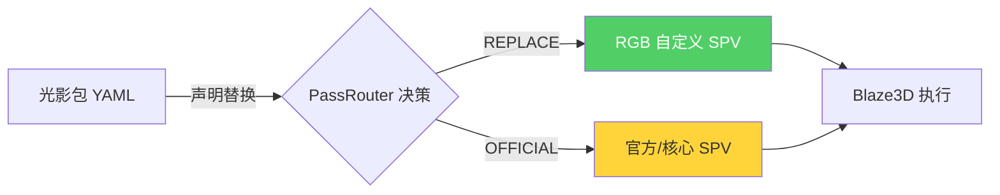
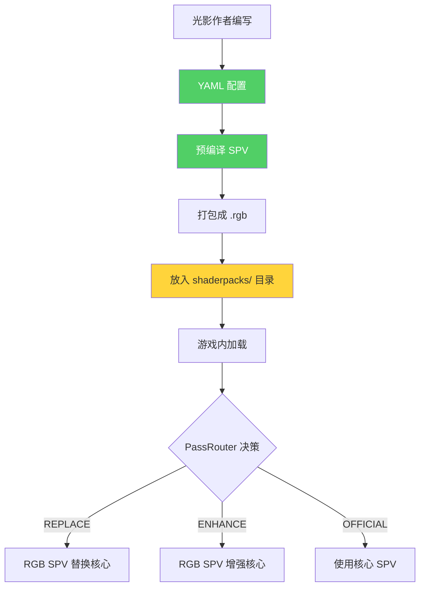

# 🚨 Shaders 目录保护规则

> **核心原则**：`renderium/common/src/main/resources/shaders/` 是 **Renderium 核心着色器**，不是 RGB 光影包的修改目标。

---

## 📁 当前目录结构（核心 Renderium Shader）

```
shaders/
├── compute/              # 🔒 核心计算（Hi-Z、剔除、间接绘制）
│   ├── hiz_build.comp
│   ├── hiz_occlusion_query.comp
│   ├── lod_cull.comp
│   ├── frustum_culling.comp
│   ├── cull_lod.comp
│   ├── hiz_occlusion_culling.comp
│   ├── indirect_draw_gen.comp
│   └── async_section_cull.comp
│
├── lighting/             # 🔒 核心光照（Bloom、ACES、曝光）
│   ├── bloom.frag
│   ├── color_correction.frag
│   ├── exposure_adaptation.comp
│   └── tonemap_aces.frag
│
├── lod/                  # 🔒 LOD 计算
│   └── lod_compute.comp
│
├── mesh/                 # 🔒 Meshlet 渲染
│   └── meshlet_mesh.shader
│
├── task/                 # 🔒 Meshlet 任务选择
│   └── meshlet_task_selection.comp
│
├── vertex/               # 🔒 顶点变换
│   ├── gpu_vertex_transform.vert
│   └── vertex_decompress.vert
│
├── raygen/               # 🔒 光线追踪（Ray Generation）
│   └── shadow.raygen
│
├── anyhit/               # 🔒 光线追踪（Any Hit）
│   └── shadow.rahitglsl
│
├── closesthit/           # 🔒 光线追踪（Closest Hit）
│   └── shadow.rchitglsl
│
├── miss/                 # 🔒 光线追踪（Miss）
│   └── shadow.rmissglsl
│
├── stylizedrt/           # 🔒 实验性光线追踪
│   ├── adaptive_ray_march.comp
│   └── potential_field_solver.comp
│
├── nanguard.glsl         # 🔒 NaN 防护
├── sgs_anti_ringing.glsl # 🔒 抗振铃
└── lyapunov_quality.comp # 🔒 质量检查
```

**所有带 🔒 的都是核心 shader，RGB 光影包不应该修改它们。**

---

## ❌ 常见错误：Agent 乱写的场景

### 错误 1：在核心目录添加光影包文件

```diff
  shaders/
  ├── compute/
+ ├── custom_bloom.comp         ❌ 错误！应该放在光影包目录
+ ├── enhanced_shadows.comp     ❌ 错误！应该放在光影包目录
  └── ...
```

### 错误 2：修改核心 shader 内容

```diff
- // shaders/compute/hiz_build.comp
- // Hi-Z Mipmap 构建 (workgroup: 16x16)
+ // 光影包修改版 Hi-Z
+ // 增加了自定义逻辑
```

### 错误 3：混淆渲染通道

```diff
- Renderium 核心: hiz_build.comp → LodCullingComputePass
- RGB 光影包: custom_gbuffer.spv → ShaderWorkbench
+ Agent 错误: 在 ShaderWorkbench 中加载核心 compute shader
```

---

## ✅ 正确做法

### 1. RGB 光影包应该放在**外部目录**

```
用户数据目录/
└── shaderpacks/          # 光影包目录（外部）
    ├── cinematic-shadows.rgb/
    │   ├── pack.yaml
    │   └── shaders/      # 光影作者的 shader
    │       ├── custom_gbuffer.comp.spv
    │       └── enhanced_reflection.comp.spv
    │
    └── anime-style.rgb/
        ├── pack.yaml
        └── shaders/
            └── cel_shading.comp.spv
```

### 2. RGB 光影包只能**替换/增强**，不能修改核心文件



### 3. Agent 应该做什么

| 任务 | 正确做法 | 错误做法 |
|------|---------|---------|
| 添加新 shader | 创建 `shaders/rgb/` 或外部目录 | 直接修改 `shaders/compute/` |
| 修改光照效果 | 创建新 `.comp.spv` + YAML 配置 | 修改 `lighting/bloom.frag` |
| 测试光影包 | 使用外部 `.rgb` 光影包 | 侵入核心 shader 目录 |

---

## 🛡️ 保护机制

### 方案 1：使用 .gitattributes 标记核心文件

创建 `.gitattributes` 文件：

```gitattributes
# 核心 shader - 禁止自动修改
renderium/common/src/main/resources/shaders/**/* linguist-generated
```

### 方案 2：添加 README.md 警告

```markdown
# ⚠️ 核心 Shader 目录

此目录包含 Renderium 核心着色器，**不应该被 RGB 光影包或外部工具修改**。

RGB 光影包应该：
1. 使用外部 `.rgb` 光影包格式
2. 通过 YAML 配置替换/增强 Pass
3. 不直接修改此目录中的文件
```

### 方案 3：代码层面验证

```java
// ShaderWorkbench.java - 防止加载核心 shader 目录
public class ShaderWorkbench {
    
    private void loadPack(String packPath) {
        // 检查是否在核心 shader 目录
        if (packPath.contains("renderium/common/src/main/resources/shaders")) {
            throw new SecurityException(
                "RGB 光影包不应该在核心 shader 目录！" +
                "请使用外部光影包目录。");
        }
        // ... 正常加载逻辑
    }
}
```

---

## 📝 Agent 提示规则

> **请在 `.trae/rules/project_rules.md` 中添加以下规则：**

```markdown
## Shader 目录保护规则

1. `renderium/common/src/main/resources/shaders/` 是**核心着色器目录**
2. RGB 光影包**不应该**修改此目录中的任何文件
3. 新增的 RGB 光影包 shader 应该：
   - 放在外部 `shaderpacks/` 目录
   - 或使用 `shaders/rgb/` 子目录（如果必须在项目中）
4. 光影包通过 YAML 配置和 SPIR-V 热插拔来替换/增强效果
5. 禁止在 `shaders/compute/`, `shaders/lighting/` 等核心子目录中添加光影包文件
```

---

## 🔄 正确的 RGB 光影包工作流程



**关键**：光影包不修改核心文件，而是通过**替换/增强**机制在运行时决定使用哪个 shader。

---

*文档版本：v1.0 (2026-04-22)*
*目标：防止 Agent 和开发者错误修改核心 shader 目录*
